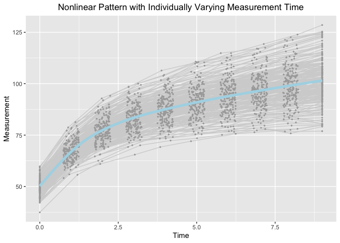

Jenss-Bayley Latent Change Score Model with Individual Ratio of Growth
Acceleration in the Framework of Individual Measurement Occasions
================
Jin Liu

## Require package would be used

``` r
library(OpenMx)
library(tidyr)
library(ggplot2)
```

## OS, R version and OpenMx Version

``` r
mxOption(model = NULL, key = "Default optimizer", "CSOLNP", reset = FALSE)
mxVersion()
```

    ## OpenMx version: 2.19.8 [GIT v2.19.8-dirty]
    ## R version: R version 4.1.2 (2021-11-01)
    ## Platform: x86_64-apple-darwin17.0 
    ## MacOS: 12.3.1
    ## Default optimizer: CSOLNP
    ## NPSOL-enabled?: Yes
    ## OpenMP-enabled?: Yes

## “True” values of parameters

``` r
## Set "true" values to parameters
###################################
#### eta0: the intercept (the measurement at initial status)
# eta0.mean <- 50; eta0.var <- 16
#### eta1: the slope of the linear asymptote
# eta1.mean <- 2.5; eta1.var <- 1
#### eta2: the vertical distance between the actual intercept and the intercept of linear asymptote
# eta2.mean <- -30; eta2.var <- 36
#### exp(gamma): the ratio of acceleration of (t+1)/t 
# gamma.mean <- -0.7; gamma.var <- 0.10^2;
# rho <- 0.3
```

## Define Parameter lists

``` r
paraJB_LCSM_f <- c("mueta0", "mueta1", "mueta2", "gamma", 
                   paste0("psi", c("00", "01", "02", "11", "12", "22")),
                   paste0("instant_rate_est", 1:9), paste0("instant_rate_var", 1:9), paste0("change_in_interval", 1:9),
                   paste0("change_from_baseline", 1:9), "residuals")

paraJB_LCSM_r <- c("mueta0", "mueta1", "mueta2", "gamma", 
                   paste0("psi", c("00", "01", "02", "0g", "11", "12", "1g", "22", "2g", "gg")),
                   paste0("instant_rate_est", 1:9), paste0("instant_rate_var", 1:9), paste0("change_in_interval", 1:9),
                   paste0("change_from_baseline", 1:9), "residuals")
```

## Read in dataset for analyses (wide-format data)

``` r
load("JB_random_dat.RData")
```

## Summarize data

``` r
summary(JB_random_dat)
```

    ##        id               Y1              Y2              Y3       
    ##  Min.   :  1.00   Min.   :38.15   Min.   :54.64   Min.   :63.96  
    ##  1st Qu.: 50.75   1st Qu.:47.77   1st Qu.:64.53   1st Qu.:73.25  
    ##  Median :100.50   Median :50.45   Median :67.52   Median :77.55  
    ##  Mean   :100.50   Mean   :50.13   Mean   :67.51   Mean   :77.42  
    ##  3rd Qu.:150.25   3rd Qu.:52.71   3rd Qu.:70.83   3rd Qu.:81.63  
    ##  Max.   :200.00   Max.   :61.13   Max.   :83.06   Max.   :93.62  
    ##        Y4              Y5               Y6               Y7        
    ##  Min.   :67.95   Min.   : 71.68   Min.   : 74.64   Min.   : 74.59  
    ##  1st Qu.:79.88   1st Qu.: 83.23   1st Qu.: 86.09   1st Qu.: 88.82  
    ##  Median :83.32   Median : 87.47   Median : 91.72   Median : 94.14  
    ##  Mean   :83.45   Mean   : 87.69   Mean   : 91.10   Mean   : 93.96  
    ##  3rd Qu.:87.84   3rd Qu.: 92.88   3rd Qu.: 96.41   3rd Qu.: 99.85  
    ##  Max.   :99.84   Max.   :105.80   Max.   :110.09   Max.   :113.66  
    ##        Y8               Y9              Y10               T1   
    ##  Min.   : 74.86   Min.   : 77.29   Min.   : 78.26   Min.   :0  
    ##  1st Qu.: 91.27   1st Qu.: 94.03   1st Qu.: 95.06   1st Qu.:0  
    ##  Median : 96.36   Median : 99.43   Median :101.52   Median :0  
    ##  Mean   : 96.54   Mean   : 99.25   Mean   :101.58   Mean   :0  
    ##  3rd Qu.:102.43   3rd Qu.:105.79   3rd Qu.:108.62   3rd Qu.:0  
    ##  Max.   :116.67   Max.   :120.20   Max.   :125.84   Max.   :0  
    ##        T2               T3              T4              T5       
    ##  Min.   :0.7507   Min.   :1.752   Min.   :2.750   Min.   :3.759  
    ##  1st Qu.:0.8760   1st Qu.:1.864   1st Qu.:2.886   1st Qu.:3.880  
    ##  Median :0.9866   Median :2.000   Median :2.995   Median :3.987  
    ##  Mean   :0.9909   Mean   :1.994   Mean   :3.006   Mean   :3.992  
    ##  3rd Qu.:1.1040   3rd Qu.:2.119   3rd Qu.:3.122   3rd Qu.:4.107  
    ##  Max.   :1.2481   Max.   :2.247   Max.   :3.243   Max.   :4.248  
    ##        T6              T7              T8              T9             T10   
    ##  Min.   :4.751   Min.   :5.751   Min.   :6.750   Min.   :7.750   Min.   :9  
    ##  1st Qu.:4.881   1st Qu.:5.871   1st Qu.:6.875   1st Qu.:7.881   1st Qu.:9  
    ##  Median :5.001   Median :6.008   Median :6.988   Median :8.012   Median :9  
    ##  Mean   :5.004   Mean   :6.010   Mean   :6.990   Mean   :8.003   Mean   :9  
    ##  3rd Qu.:5.120   3rd Qu.:6.155   3rd Qu.:7.110   3rd Qu.:8.124   3rd Qu.:9  
    ##  Max.   :5.239   Max.   :6.248   Max.   :7.248   Max.   :8.248   Max.   :9

## Visualize data

``` r
long_dat_T <- gather(JB_random_dat, var.T, time, T1:T10)
long_dat_Y <- gather(JB_random_dat, var.Y, measures, Y1:Y10)
long_dat <- data.frame(id = long_dat_T[, 1], time = long_dat_T[, 13],
                       measures = long_dat_Y[, 13])
ggplot(aes(x = time, y = measures), data = long_dat) +
  geom_line(aes(group = id), color = "lightgrey") +
  geom_point(aes(group = id), color = "darkgrey", size = 0.5) +
  geom_smooth(aes(group = 1), size = 1.8, col = "lightblue", se = F) + 
  labs(title = "Nonlinear Pattern with Individually Varying Measurement Time",
       x ="Time", y = "Measurement") + 
  theme(plot.title = element_text(hjust = 0.5))
```

    ## `geom_smooth()` using method = 'gam' and formula 'y ~ s(x, bs = "cs")'

<!-- -->

## Jenss-Bayley Latent Change Model with Random Ratio of Growth Acceleration

``` r
source("LCSM_JB_random.R")
JB_LCSM_r <- getLCSM_JB_random(dat = JB_random_dat, T_records = 1:10, traj_var = "Y", t_var = "T",
                               paraNames = paraJB_LCSM_r)
JB_LCSM_r[[2]]
```

    ##                     Name Estimate     SE
    ## 1                 mueta0  50.1478 0.2831
    ## 2                 mueta1   2.4500 0.0679
    ## 3                 mueta2 -30.1849 0.5013
    ## 4                  gamma  -0.7119 0.0103
    ## 5                  psi00  15.0815 1.6048
    ## 6                  psi01   0.7319 0.2768
    ## 7                  psi02   7.6966 2.0975
    ## 8                  psi0g   0.1824 0.0444
    ## 9                  psi11   0.8016 0.0926
    ## 10                 psi12   1.2555 0.5062
    ## 11                 psi1g   0.0423 0.0100
    ## 12                 psi22  43.7800 5.0547
    ## 13                 psi2g   0.3572 0.0754
    ## 14                 psigg   0.0082 0.0022
    ## 15     instant_rate_est1  17.5517 0.2934
    ## 16     instant_rate_est2   9.8775 0.1210
    ## 17     instant_rate_est3   6.0755 0.0842
    ## 18     instant_rate_est4   4.2299 0.0758
    ## 19     instant_rate_est5   3.3241 0.0715
    ## 20     instant_rate_est6   2.8762 0.0693
    ## 21     instant_rate_est7   2.6602 0.0684
    ## 22     instant_rate_est8   2.5534 0.0681
    ## 23     instant_rate_est9   2.5006 0.0680
    ## 24     instant_rate_var1  10.5038 1.1751
    ## 25     instant_rate_var2   2.8346 0.2953
    ## 26     instant_rate_var3   1.1316 0.1158
    ## 27     instant_rate_var4   0.8058 0.0855
    ## 28     instant_rate_var5   0.7656 0.0847
    ## 29     instant_rate_var6   0.7749 0.0877
    ## 30     instant_rate_var7   0.7863 0.0899
    ## 31     instant_rate_var8   0.7935 0.0912
    ## 32     instant_rate_var9   0.7975 0.0919
    ## 33   change_in_interval1  17.3917 0.2907
    ## 34   change_in_interval2   9.9045 0.1213
    ## 35   change_in_interval3   6.1497 0.0852
    ## 36   change_in_interval4   4.1728 0.0747
    ## 37   change_in_interval5   3.3619 0.0723
    ## 38   change_in_interval6   2.8945 0.0697
    ## 39   change_in_interval7   2.6070 0.0670
    ## 40   change_in_interval8   2.5870 0.0690
    ## 41   change_in_interval9   2.4925 0.0678
    ## 42 change_from_baseline1  17.3917 0.2907
    ## 43 change_from_baseline2  27.2962 0.3950
    ## 44 change_from_baseline3  33.4459 0.4396
    ## 45 change_from_baseline4  37.6187 0.4687
    ## 46 change_from_baseline5  40.9806 0.4981
    ## 47 change_from_baseline6  43.8751 0.5313
    ## 48 change_from_baseline7  46.4821 0.5683
    ## 49 change_from_baseline8  49.0691 0.6112
    ## 50 change_from_baseline9  51.5616 0.6573
    ## 51             residuals   0.9875 0.0403

## Jenss-Bayley Latent Change Model with Fixed Ratio of Growth Acceleration

``` r
source("LCSM_JB_fixed.R")
JB_LCSM_f <- getLCSM_JB_fixed(dat = JB_random_dat, T_records = 1:10, traj_var = "Y", t_var = "T",
                              paraNames = paraJB_LCSM_f)
JB_LCSM_f[[2]]
```

    ##                     Name Estimate     SE
    ## 1                 mueta0  50.0919 0.2749
    ## 2                 mueta1   2.4852 0.0772
    ## 3                 mueta2 -29.9710 0.5621
    ## 4                  gamma  -0.7272 0.0083
    ## 5                  psi00  14.0748 1.5015
    ## 6                  psi01   1.0156 0.2978
    ## 7                  psi02   9.2101 2.2486
    ## 8                  psi11   1.0695 0.1105
    ## 9                  psi12   3.1280 0.6252
    ## 10                 psi22  56.6691 6.0054
    ## 11     instant_rate_est1  17.6868 0.2641
    ## 12     instant_rate_est2   9.8486 0.1248
    ## 13     instant_rate_est3   6.0244 0.0803
    ## 14     instant_rate_est4   4.1964 0.0696
    ## 15     instant_rate_est5   3.3128 0.0695
    ## 16     instant_rate_est6   2.8826 0.0718
    ## 17     instant_rate_est7   2.6782 0.0738
    ## 18     instant_rate_est8   2.5787 0.0753
    ## 19     instant_rate_est9   2.5303 0.0761
    ## 20     instant_rate_var1  12.4751 1.3127
    ## 21     instant_rate_var2   2.9530 0.3054
    ## 22     instant_rate_var3   1.1209 0.1140
    ## 23     instant_rate_var4   0.8970 0.0912
    ## 24     instant_rate_var5   0.9399 0.0963
    ## 25     instant_rate_var6   0.9965 0.1025
    ## 26     instant_rate_var7   1.0315 0.1063
    ## 27     instant_rate_var8   1.0505 0.1084
    ## 28     instant_rate_var9   1.0602 0.1095
    ## 29   change_in_interval1  17.5255 0.2617
    ## 30   change_in_interval2   9.8755 0.1252
    ## 31   change_in_interval3   6.0979 0.0813
    ## 32   change_in_interval4   4.1397 0.0686
    ## 33   change_in_interval5   3.3504 0.0703
    ## 34   change_in_interval6   2.9009 0.0722
    ## 35   change_in_interval7   2.6246 0.0724
    ## 36   change_in_interval8   2.6127 0.0762
    ## 37   change_in_interval9   2.5222 0.0759
    ## 38 change_from_baseline1  17.5255 0.2617
    ## 39 change_from_baseline2  27.4010 0.3761
    ## 40 change_from_baseline3  33.4989 0.4330
    ## 41 change_from_baseline4  37.6387 0.4678
    ## 42 change_from_baseline5  40.9891 0.4983
    ## 43 change_from_baseline6  43.8900 0.5310
    ## 44 change_from_baseline7  46.5147 0.5679
    ## 45 change_from_baseline8  49.1273 0.6122
    ## 46 change_from_baseline9  51.6495 0.6612
    ## 47             residuals   1.0728 0.0406
