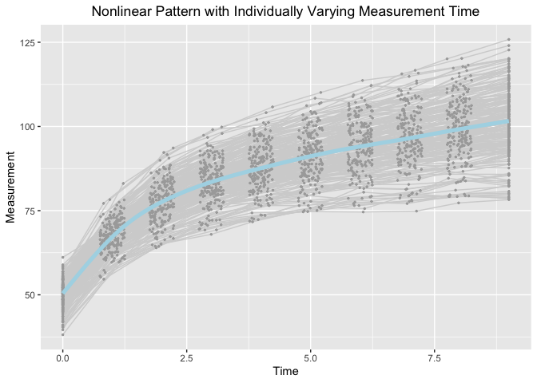

Jenss-Bayley Latent Change Score Model with Individual Ratio of Growth
Acceleration in the Framework of Individual Measurement Occasions
================
Jin Liu

## Require package would be used

``` r
library(OpenMx)
```

    ## To take full advantage of multiple cores, use:
    ##   mxOption(key='Number of Threads', value=parallel::detectCores()) #now
    ##   Sys.setenv(OMP_NUM_THREADS=parallel::detectCores()) #before library(OpenMx)

``` r
library(tidyr)
library(ggplot2)
```

## OS, R version and OpenMx Version

``` r
mxOption(model = NULL, key = "Default optimizer", "CSOLNP", reset = FALSE)
mxVersion()
```

    ## OpenMx version: 2.19.8 [GIT v2.19.8-dirty]
    ## R version: R version 4.1.2 (2021-11-01)
    ## Platform: x86_64-apple-darwin17.0 
    ## MacOS: 12.3.1
    ## Default optimizer: CSOLNP
    ## NPSOL-enabled?: Yes
    ## OpenMP-enabled?: Yes

## “True” values of parameters

``` r
## Set "true" values to parameters
###################################
#### eta0: the intercept (the measurement at initial status)
# eta0.mean <- 50; eta0.var <- 16
#### eta1: the slope of the linear asymptote
# eta1.mean <- 2.5; eta1.var <- 1
#### eta2: the vertical distance between the actual intercept and the intercept of linear asymptote
# eta2.mean <- -30; eta2.var <- 36
#### exp(gamma): the ratio of acceleration of (t+1)/t 
# gamma.mean <- -0.7; gamma.var <- 0.10;
# rho <- 0.3
```

## Define Parameter lists

``` r
paraJB_LCSM_f <- c("mueta0", "mueta1", "mueta2", "gamma", 
                   paste0("psi", c("00", "01", "02", "11", "12", "22")),
                   paste0("instant_rate_est", 1:9), paste0("instant_rate_var", 1:9), paste0("change_in_interval", 1:9),
                   paste0("change_from_baseline", 1:9), "residuals")

paraJB_LCSM_r <- c("mueta0", "mueta1", "mueta2", "gamma", 
                   paste0("psi", c("00", "01", "02", "0g", "11", "12", "1g", "22", "2g", "gg")),
                   paste0("instant_rate_est", 1:9), paste0("instant_rate_var", 1:9), paste0("change_in_interval", 1:9),
                   paste0("change_from_baseline", 1:9), "residuals")
```

## Read in dataset for analyses (wide-format data)

``` r
load("JB_random_dat.RData")
```

## Summarize data

``` r
summary(JB_random_dat)
```

    ##        id               Y1              Y2              Y3       
    ##  Min.   :  1.00   Min.   :37.43   Min.   :54.10   Min.   :60.96  
    ##  1st Qu.: 50.75   1st Qu.:47.61   1st Qu.:63.52   1st Qu.:73.76  
    ##  Median :100.50   Median :49.77   Median :67.09   Median :77.48  
    ##  Mean   :100.50   Mean   :49.98   Mean   :67.23   Mean   :77.27  
    ##  3rd Qu.:150.25   3rd Qu.:52.45   3rd Qu.:70.54   3rd Qu.:80.20  
    ##  Max.   :200.00   Max.   :59.78   Max.   :81.33   Max.   :94.11  
    ##        Y4               Y5               Y6               Y7        
    ##  Min.   : 65.49   Min.   : 69.20   Min.   : 72.02   Min.   : 75.14  
    ##  1st Qu.: 78.97   1st Qu.: 82.90   1st Qu.: 86.04   1st Qu.: 88.33  
    ##  Median : 83.48   Median : 87.26   Median : 90.85   Median : 93.97  
    ##  Mean   : 83.37   Mean   : 87.64   Mean   : 90.99   Mean   : 93.79  
    ##  3rd Qu.: 87.05   3rd Qu.: 92.03   3rd Qu.: 95.58   3rd Qu.: 99.08  
    ##  Max.   :100.05   Max.   :106.39   Max.   :110.67   Max.   :114.85  
    ##        Y8               Y9              Y10               T1   
    ##  Min.   : 76.40   Min.   : 75.84   Min.   : 76.92   Min.   :0  
    ##  1st Qu.: 91.18   1st Qu.: 93.00   1st Qu.: 95.13   1st Qu.:0  
    ##  Median : 96.90   Median : 99.15   Median :101.23   Median :0  
    ##  Mean   : 96.67   Mean   : 99.13   Mean   :101.57   Mean   :0  
    ##  3rd Qu.:102.24   3rd Qu.:104.33   3rd Qu.:107.84   3rd Qu.:0  
    ##  Max.   :119.29   Max.   :123.88   Max.   :128.53   Max.   :0  
    ##        T2               T3              T4              T5       
    ##  Min.   :0.7503   Min.   :1.751   Min.   :2.753   Min.   :3.751  
    ##  1st Qu.:0.8653   1st Qu.:1.890   1st Qu.:2.853   1st Qu.:3.890  
    ##  Median :1.0085   Median :2.007   Median :3.011   Median :3.991  
    ##  Mean   :0.9945   Mean   :2.005   Mean   :2.998   Mean   :4.002  
    ##  3rd Qu.:1.1166   3rd Qu.:2.133   3rd Qu.:3.126   3rd Qu.:4.109  
    ##  Max.   :1.2488   Max.   :2.249   Max.   :3.246   Max.   :4.248  
    ##        T6              T7              T8              T9             T10   
    ##  Min.   :4.753   Min.   :5.751   Min.   :6.750   Min.   :7.756   Min.   :9  
    ##  1st Qu.:4.890   1st Qu.:5.897   1st Qu.:6.905   1st Qu.:7.892   1st Qu.:9  
    ##  Median :5.013   Median :6.006   Median :7.020   Median :7.992   Median :9  
    ##  Mean   :5.012   Mean   :6.010   Mean   :7.013   Mean   :8.000   Mean   :9  
    ##  3rd Qu.:5.134   3rd Qu.:6.128   3rd Qu.:7.147   3rd Qu.:8.124   3rd Qu.:9  
    ##  Max.   :5.249   Max.   :6.247   Max.   :7.247   Max.   :8.247   Max.   :9

## Visualize data

``` r
long_dat_T <- gather(JB_random_dat, var.T, time, T1:T10)
long_dat_Y <- gather(JB_random_dat, var.Y, measures, Y1:Y10)
long_dat <- data.frame(id = long_dat_T[, 1], time = long_dat_T[, 13],
                       measures = long_dat_Y[, 13])
ggplot(aes(x = time, y = measures), data = long_dat) +
  geom_line(aes(group = id), color = "lightgrey") +
  geom_point(aes(group = id), color = "darkgrey", size = 0.5) +
  geom_smooth(aes(group = 1), size = 1.8, col = "lightblue", se = F) + 
  labs(title = "Nonlinear Pattern with Individually Varying Measurement Time",
       x ="Time", y = "Measurement") + 
  theme(plot.title = element_text(hjust = 0.5))
```

    ## `geom_smooth()` using method = 'gam' and formula 'y ~ s(x, bs = "cs")'

<!-- -->

## Jenss-Bayley Latent Change Model with Random Ratio of Growth Acceleration

``` r
source("LCSM_JB_random.R")
JB_LCSM_r <- getLCSM_JB_random(dat = JB_random_dat, T_records = 1:10, traj_var = "Y", t_var = "T",
                               paraNames = paraJB_LCSM_r)
```

## Jenss-Bayley Latent Change Model with Fixed Ratio of Growth Acceleration

``` r
source("LCSM_JB_fixed.R")
JB_LCSM_f <- getLCSM_JB_fixed(dat = JB_random_dat, T_records = 1:10, traj_var = "Y", t_var = "T",
                              paraNames = paraJB_LCSM_f)
```
