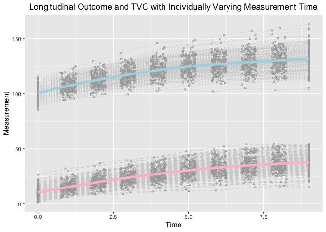
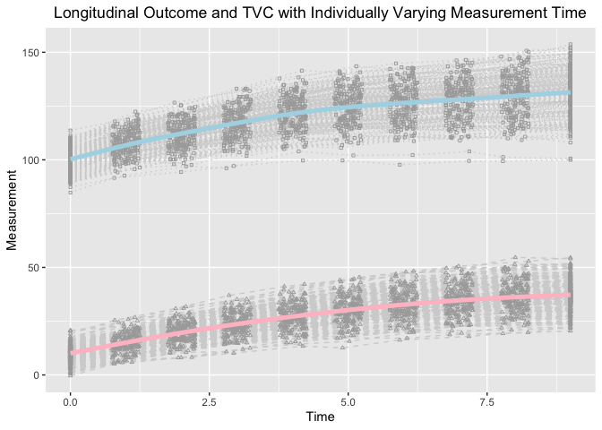
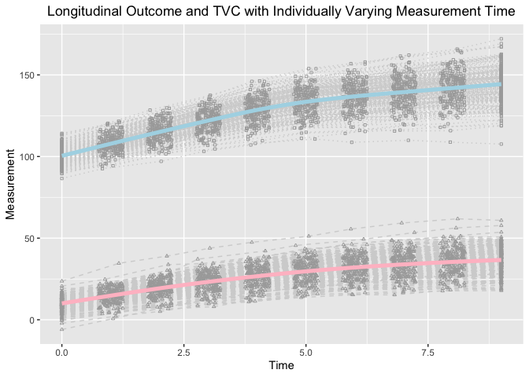

Estimating knots and Knot-knot Association of PBLSGMs in the framework
of individual measurement occasions
================
Jin Liu

## OS, R version and OpenMx Version

``` r
library(OpenMx)
```

    ## OpenMx may run faster if it is compiled to take advantage of multiple cores.

``` r
OpenMx::mxOption(model = NULL, key = "Default optimizer", "CSOLNP", reset = FALSE)
OpenMx::mxVersion()
```

    ## OpenMx version: 2.21.8 [GIT v2.21.8]
    ## R version: R version 4.2.2 (2022-10-31)
    ## Platform: aarch64-apple-darwin20 
    ## MacOS: 14.4.1
    ## Default optimizer: CSOLNP
    ## NPSOL-enabled?: No
    ## OpenMP-enabled?: No

## Require package would be used

``` r
library(tidyr)
library(ggplot2)
```

## First Model: Longitudinal Model with TVC (w/ Interval-specific Slopes)

### Read in dataset for analyses (wide-format data)

``` r
source("TVC1.R")
```

### Summarize data

``` r
summary(dat[[2]])
```

    ##        id               Y1               Y2               Y3        
    ##  Min.   :  1.00   Min.   : 84.96   Min.   : 94.61   Min.   : 97.26  
    ##  1st Qu.: 50.75   1st Qu.: 96.22   1st Qu.:103.42   1st Qu.:107.95  
    ##  Median :100.50   Median : 99.91   Median :107.25   Median :112.35  
    ##  Mean   :100.50   Mean   :100.18   Mean   :107.71   Mean   :112.55  
    ##  3rd Qu.:150.25   3rd Qu.:103.76   3rd Qu.:111.48   3rd Qu.:116.65  
    ##  Max.   :200.00   Max.   :115.35   Max.   :124.89   Max.   :129.39  
    ##        Y4               Y5              Y6              Y7       
    ##  Min.   : 99.39   Min.   :102.6   Min.   :103.7   Min.   :102.0  
    ##  1st Qu.:112.57   1st Qu.:116.4   1st Qu.:119.7   1st Qu.:121.5  
    ##  Median :116.75   Median :121.7   Median :124.6   Median :126.1  
    ##  Mean   :117.12   Mean   :121.8   Mean   :125.0   Mean   :126.7  
    ##  3rd Qu.:121.14   3rd Qu.:126.1   3rd Qu.:129.9   3rd Qu.:131.6  
    ##  Max.   :136.71   Max.   :146.1   Max.   :149.2   Max.   :153.0  
    ##        Y8              Y9             Y10              T1          T2        
    ##  Min.   :105.3   Min.   :103.4   Min.   :104.7   Min.   :0   Min.   :0.7547  
    ##  1st Qu.:122.2   1st Qu.:123.5   1st Qu.:125.1   1st Qu.:0   1st Qu.:0.8774  
    ##  Median :127.5   Median :129.2   Median :131.1   Median :0   Median :1.0107  
    ##  Mean   :128.2   Mean   :130.0   Mean   :131.6   Mean   :0   Mean   :1.0055  
    ##  3rd Qu.:134.9   3rd Qu.:136.2   3rd Qu.:138.5   3rd Qu.:0   3rd Qu.:1.1289  
    ##  Max.   :156.8   Max.   :159.5   Max.   :163.4   Max.   :0   Max.   :1.2464  
    ##        T3              T4              T5              T6       
    ##  Min.   :1.750   Min.   :2.751   Min.   :3.760   Min.   :4.753  
    ##  1st Qu.:1.880   1st Qu.:2.862   1st Qu.:3.863   1st Qu.:4.891  
    ##  Median :1.982   Median :2.993   Median :4.003   Median :5.012  
    ##  Mean   :1.996   Mean   :2.991   Mean   :4.000   Mean   :5.010  
    ##  3rd Qu.:2.119   3rd Qu.:3.113   3rd Qu.:4.141   3rd Qu.:5.142  
    ##  Max.   :2.248   Max.   :3.236   Max.   :4.247   Max.   :5.245  
    ##        T7              T8              T9             T10         TVC1       
    ##  Min.   :5.753   Min.   :6.754   Min.   :7.754   Min.   :9   Min.   : 1.057  
    ##  1st Qu.:5.851   1st Qu.:6.909   1st Qu.:7.888   1st Qu.:9   1st Qu.: 7.450  
    ##  Median :5.965   Median :6.999   Median :7.996   Median :9   Median :10.167  
    ##  Mean   :5.982   Mean   :7.010   Mean   :8.002   Mean   :9   Mean   :10.304  
    ##  3rd Qu.:6.120   3rd Qu.:7.123   3rd Qu.:8.122   3rd Qu.:9   3rd Qu.:12.768  
    ##  Max.   :6.246   Max.   :7.246   Max.   :8.250   Max.   :9   Max.   :26.450  
    ##       TVC2             TVC3             TVC4             TVC5      
    ##  Min.   : 5.552   Min.   : 8.637   Min.   : 8.982   Min.   :11.38  
    ##  1st Qu.:12.473   1st Qu.:16.628   1st Qu.:19.837   1st Qu.:23.04  
    ##  Median :14.988   Median :19.779   Median :23.553   Median :26.77  
    ##  Mean   :15.437   Mean   :19.914   Mean   :23.908   Mean   :27.33  
    ##  3rd Qu.:17.979   3rd Qu.:22.835   3rd Qu.:27.536   3rd Qu.:31.26  
    ##  Max.   :32.008   Max.   :37.025   Max.   :40.049   Max.   :43.33  
    ##       TVC6            TVC7            TVC8            TVC9      
    ##  Min.   :11.71   Min.   :12.06   Min.   :15.43   Min.   :15.82  
    ##  1st Qu.:26.08   1st Qu.:28.34   1st Qu.:29.89   1st Qu.:31.69  
    ##  Median :30.23   Median :32.60   Median :34.12   Median :36.01  
    ##  Mean   :30.39   Mean   :32.92   Mean   :34.87   Mean   :36.49  
    ##  3rd Qu.:34.68   3rd Qu.:37.14   3rd Qu.:39.06   3rd Qu.:41.18  
    ##  Max.   :47.77   Max.   :52.34   Max.   :54.02   Max.   :54.57  
    ##      TVC10            TIC           
    ##  Min.   :15.33   Min.   :-2.528252  
    ##  1st Qu.:32.66   1st Qu.:-0.634623  
    ##  Median :37.10   Median : 0.007366  
    ##  Mean   :37.49   Mean   :-0.007483  
    ##  3rd Qu.:41.80   3rd Qu.: 0.693755  
    ##  Max.   :54.44   Max.   : 2.306403

### Visualize data

``` r
long_dat_T <- gather(dat[[2]][, c(1, 12:21), ], key = var.T, value = time, T1:T10)
long_dat_Y <- gather(dat[[2]][, c(1, 2:11), ], key = var.Y, value = measuresY, Y1:Y10)
long_dat_Y$outcome <- "Y"
long_dat_TVC <- gather(dat[[2]][, c(1, 22:31), ], key = var.TVC, value = measuresTVC, TVC1:TVC10)
long_dat_TVC$outcome <- "TVC"
long_dat <- data.frame(id = rep(long_dat_T$id, 2),
                       time = rep(long_dat_T$time, 2),
                       measures = c(long_dat_Y$measuresY, long_dat_TVC$measuresTVC),
                       outcome = c(long_dat_Y$outcome, long_dat_TVC$outcome))

ggplot(aes(x = time, y = measures), data = long_dat) +
  geom_line(aes(group = id), color = "lightgrey", linetype = "dotted", 
            data = long_dat[long_dat$outcome == "Y", ]) +
  geom_line(aes(group = id), color = "lightgrey", linetype = "dashed", 
            data = long_dat[long_dat$outcome == "TVC", ]) +
  geom_point(aes(group = id), color = "darkgrey", shape = 0,
             data = long_dat[long_dat$outcome == "Y", ], size = 0.8) +
  geom_point(aes(group = id), color = "darkgrey", shape = 2,
             data = long_dat[long_dat$outcome == "TVC", ], size = 0.8) +
  geom_smooth(aes(group = 1), size = 1.8, col = "lightblue", se = F, 
              data = long_dat[long_dat$outcome == "Y", ] ) + 
  geom_smooth(aes(group = 1), size = 1.8, col = "pink", se = F, 
              data = long_dat[long_dat$outcome == "TVC", ] ) + 
  labs(title = "Longitudinal Outcome and TVC with Individually Varying Measurement Time",
       x ="Time", y = "Measurement") + 
  theme(plot.title = element_text(hjust = 0.5))
```

    ## Warning: Using `size` aesthetic for lines was deprecated in ggplot2 3.4.0.
    ## ℹ Please use `linewidth` instead.
    ## This warning is displayed once every 8 hours.
    ## Call `lifecycle::last_lifecycle_warnings()` to see where this warning was
    ## generated.

    ## `geom_smooth()` using method = 'gam' and formula = 'y ~ s(x, bs = "cs")'
    ## `geom_smooth()` using method = 'gam' and formula = 'y ~ s(x, bs = "cs")'

<!-- -->

``` r
out
```

    ##             Name     Estimate         SE         true
    ## 1       Y_mueta0 100.19551369 0.38480404 100.00000000
    ## 2       Y_mueta1   4.96634749 0.07379602   5.00000000
    ## 3       Y_mueta2   1.90074140 0.07412696   1.80000000
    ## 4          Y_mug   4.48906070 0.03021662   4.50000000
    ## 5  Y_psi00_unexp  22.01722442 2.25057475  18.49999897
    ## 6  Y_psi01_unexp   0.02664215 0.30486400   0.20000002
    ## 7  Y_psi02_unexp   0.42130659 0.30505846   0.20000002
    ## 8  Y_psi11_unexp   0.76457145 0.08283679   0.74000005
    ## 9  Y_psi12_unexp  -0.01485375 0.05821516   0.04000005
    ## 10 Y_psi22_unexp   0.75732962 0.08204083   0.74000005
    ## 11      X_mueta0  10.34307383 0.29123217  10.00000000
    ## 12      X_mueta1   5.02573179 0.10942476   5.00000000
    ## 13       X_psi00  16.05369349 1.63793818  16.00000000
    ## 14       X_psi01   1.00757644 0.28256928   1.20000000
    ## 15       X_psi11   1.00054776 0.10834439   1.00000000
    ## 16     rel_rate3   0.90662297 0.02594956   0.90000000
    ## 17     rel_rate4   0.79272748 0.02101916   0.80000000
    ## 18     rel_rate5   0.68671356 0.02086474   0.70000000
    ## 19     rel_rate6   0.58751274 0.01846275   0.60000000
    ## 20     rel_rate7   0.54060801 0.01847926   0.50000000
    ## 21     rel_rate8   0.36739540 0.01619215   0.40000000
    ## 22     rel_rate9   0.32685803 0.01668687   0.30000000
    ## 23    rel_rate10   0.19199309 0.01789068   0.20000000
    ## 24     abs_rate3   4.55644390 0.10318704   4.50000000
    ## 25     abs_rate4   3.98403569 0.09829663   4.00000000
    ## 26     abs_rate5   3.45123818 0.09752288   3.50000000
    ## 27     abs_rate6   2.95268146 0.08947118   3.00000000
    ## 28     abs_rate7   2.71695085 0.08968302   2.50000000
    ## 29     abs_rate8   1.84643076 0.07974651   2.00000000
    ## 30     abs_rate9   1.64270081 0.08259969   1.50000000
    ## 31    abs_rate10   0.96490576 0.08953924   1.00000000
    ## 32         muTIC  -0.00748340 0.07418516   0.00000000
    ## 33        varTIC   1.10070693 0.11003918   1.00000000
    ## 34         covBL   1.38034979 0.30926280   1.20000000
    ## 35         kappa   0.51413254 0.01858076   0.50000000
    ## 36      betaTIC0   1.00794189 0.33966667   1.25150500
    ## 37      betaTIC1   0.24676657 0.06508388   0.25030100
    ## 38      betaTIC2   0.29914442 0.06475885   0.25030100
    ## 39      betaTVC0   0.50621275 0.08998217   0.46931450
    ## 40      betaTVC1   0.06948221 0.01725215   0.09386287
    ## 41      betaTVC2   0.06524611 0.01714853   0.09386287
    ## 42    Y_residual   0.98601953 0.03730155   1.00000000
    ## 43    X_residual   1.00211261 0.03538473   1.00000000
    ## 44     Cov_XYres   0.32054220 0.02763156   0.30000000

## Second Model: Longitudinal Model with TVC (w/ Interval-specific Change)

### Read in dataset for analyses (wide-format data)

``` r
source("TVC2.R")
```

### Summarize data

``` r
summary(dat[[2]])
```

    ##        id               Y1               Y2               Y3        
    ##  Min.   :  1.00   Min.   : 84.79   Min.   : 91.61   Min.   : 94.37  
    ##  1st Qu.: 50.75   1st Qu.: 96.53   1st Qu.:103.37   1st Qu.:107.14  
    ##  Median :100.50   Median :100.01   Median :107.20   Median :112.16  
    ##  Mean   :100.50   Mean   : 99.92   Mean   :107.51   Mean   :111.96  
    ##  3rd Qu.:150.25   3rd Qu.:103.62   3rd Qu.:111.77   3rd Qu.:116.87  
    ##  Max.   :200.00   Max.   :113.64   Max.   :122.41   Max.   :126.61  
    ##        Y4               Y5              Y6               Y7        
    ##  Min.   : 96.12   Min.   : 99.7   Min.   : 99.71   Min.   : 97.73  
    ##  1st Qu.:111.27   1st Qu.:116.0   1st Qu.:118.49   1st Qu.:119.73  
    ##  Median :116.97   Median :121.7   Median :125.27   Median :127.26  
    ##  Mean   :116.74   Mean   :121.7   Mean   :124.66   Mean   :126.33  
    ##  3rd Qu.:122.06   3rd Qu.:127.2   3rd Qu.:130.70   3rd Qu.:132.71  
    ##  Max.   :133.09   Max.   :141.5   Max.   :143.50   Max.   :144.84  
    ##        Y8              Y9              Y10               T1          T2        
    ##  Min.   : 99.5   Min.   : 99.39   Min.   : 99.97   Min.   :0   Min.   :0.7514  
    ##  1st Qu.:121.1   1st Qu.:121.95   1st Qu.:123.92   1st Qu.:0   1st Qu.:0.8685  
    ##  Median :129.3   Median :131.10   Median :132.67   Median :0   Median :1.0196  
    ##  Mean   :128.0   Mean   :129.75   Mean   :131.37   Mean   :0   Mean   :1.0059  
    ##  3rd Qu.:134.5   3rd Qu.:137.48   3rd Qu.:139.20   3rd Qu.:0   3rd Qu.:1.1431  
    ##  Max.   :146.4   Max.   :150.75   Max.   :153.73   Max.   :0   Max.   :1.2492  
    ##        T3              T4              T5              T6       
    ##  Min.   :1.758   Min.   :2.753   Min.   :3.753   Min.   :4.750  
    ##  1st Qu.:1.892   1st Qu.:2.859   1st Qu.:3.889   1st Qu.:4.891  
    ##  Median :2.001   Median :2.979   Median :4.024   Median :5.009  
    ##  Mean   :2.000   Mean   :2.981   Mean   :4.015   Mean   :5.011  
    ##  3rd Qu.:2.119   3rd Qu.:3.099   3rd Qu.:4.143   3rd Qu.:5.122  
    ##  Max.   :2.248   Max.   :3.248   Max.   :4.250   Max.   :5.248  
    ##        T7              T8              T9             T10         TVC1        
    ##  Min.   :5.751   Min.   :6.751   Min.   :7.752   Min.   :9   Min.   :-0.3988  
    ##  1st Qu.:5.871   1st Qu.:6.860   1st Qu.:7.902   1st Qu.:9   1st Qu.: 7.5009  
    ##  Median :6.002   Median :6.997   Median :8.012   Median :9   Median :10.5104  
    ##  Mean   :5.997   Mean   :6.997   Mean   :8.017   Mean   :9   Mean   :10.0104  
    ##  3rd Qu.:6.123   3rd Qu.:7.133   3rd Qu.:8.142   3rd Qu.:9   3rd Qu.:12.7314  
    ##  Max.   :6.242   Max.   :7.248   Max.   :8.249   Max.   :9   Max.   :20.7562  
    ##       TVC2             TVC3            TVC4            TVC5      
    ##  Min.   : 5.136   Min.   : 8.01   Min.   :10.12   Min.   :13.41  
    ##  1st Qu.:12.466   1st Qu.:16.50   1st Qu.:20.58   1st Qu.:23.52  
    ##  Median :15.063   Median :19.77   Median :23.34   Median :27.25  
    ##  Mean   :15.149   Mean   :19.58   Mean   :23.61   Mean   :27.20  
    ##  3rd Qu.:18.154   3rd Qu.:22.76   3rd Qu.:27.29   3rd Qu.:30.95  
    ##  Max.   :26.789   Max.   :31.77   Max.   :36.98   Max.   :42.18  
    ##       TVC6            TVC7            TVC8            TVC9      
    ##  Min.   :12.61   Min.   :16.23   Min.   :17.93   Min.   :19.29  
    ##  1st Qu.:26.51   1st Qu.:28.69   1st Qu.:30.44   1st Qu.:31.82  
    ##  Median :29.93   Median :32.69   Median :34.35   Median :36.40  
    ##  Mean   :30.20   Mean   :32.69   Mean   :34.76   Mean   :36.25  
    ##  3rd Qu.:33.80   3rd Qu.:37.18   3rd Qu.:39.07   3rd Qu.:40.62  
    ##  Max.   :45.42   Max.   :48.27   Max.   :50.51   Max.   :54.63  
    ##      TVC10            TIC          
    ##  Min.   :20.49   Min.   :-2.53600  
    ##  1st Qu.:33.05   1st Qu.:-0.52022  
    ##  Median :37.13   Median : 0.08508  
    ##  Mean   :37.14   Mean   : 0.10115  
    ##  3rd Qu.:41.45   3rd Qu.: 0.82901  
    ##  Max.   :54.51   Max.   : 2.85827

### Visualize data

``` r
long_dat_T <- gather(dat[[2]][, c(1, 12:21), ], key = var.T, value = time, T1:T10)
long_dat_Y <- gather(dat[[2]][, c(1, 2:11), ], key = var.Y, value = measuresY, Y1:Y10)
long_dat_Y$outcome <- "Y"
long_dat_TVC <- gather(dat[[2]][, c(1, 22:31), ], key = var.TVC, value = measuresTVC, TVC1:TVC10)
long_dat_TVC$outcome <- "TVC"
long_dat <- data.frame(id = rep(long_dat_T$id, 2),
                       time = rep(long_dat_T$time, 2),
                       measures = c(long_dat_Y$measuresY, long_dat_TVC$measuresTVC),
                       outcome = c(long_dat_Y$outcome, long_dat_TVC$outcome))

ggplot(aes(x = time, y = measures), data = long_dat) +
  geom_line(aes(group = id), color = "lightgrey", linetype = "dotted", 
            data = long_dat[long_dat$outcome == "Y", ]) +
  geom_line(aes(group = id), color = "lightgrey", linetype = "dashed", 
            data = long_dat[long_dat$outcome == "TVC", ]) +
  geom_point(aes(group = id), color = "darkgrey", shape = 0,
             data = long_dat[long_dat$outcome == "Y", ], size = 0.8) +
  geom_point(aes(group = id), color = "darkgrey", shape = 2,
             data = long_dat[long_dat$outcome == "TVC", ], size = 0.8) +
  geom_smooth(aes(group = 1), size = 1.8, col = "lightblue", se = F, 
              data = long_dat[long_dat$outcome == "Y", ] ) + 
  geom_smooth(aes(group = 1), size = 1.8, col = "pink", se = F, 
              data = long_dat[long_dat$outcome == "TVC", ] ) + 
  labs(title = "Longitudinal Outcome and TVC with Individually Varying Measurement Time",
       x ="Time", y = "Measurement") + 
  theme(plot.title = element_text(hjust = 0.5))
```

    ## `geom_smooth()` using method = 'gam' and formula = 'y ~ s(x, bs = "cs")'
    ## `geom_smooth()` using method = 'gam' and formula = 'y ~ s(x, bs = "cs")'

<!-- -->

``` r
out
```

    ##             Name    Estimate         SE         true
    ## 1       Y_mueta0 99.88535076 0.38024043 100.00000000
    ## 2       Y_mueta1  4.99133469 0.07885752   5.00000000
    ## 3       Y_mueta2  1.95455811 0.07183447   1.80000000
    ## 4          Y_mug  4.43176631 0.03045493   4.50000000
    ## 5  Y_psi00_unexp 22.93350676 2.34360577  18.49999897
    ## 6  Y_psi01_unexp  0.52930613 0.32503968   0.20000002
    ## 7  Y_psi02_unexp  0.36047905 0.29286980   0.20000002
    ## 8  Y_psi11_unexp  0.82642990 0.08970048   0.74000005
    ## 9  Y_psi12_unexp  0.01364386 0.05692052   0.04000005
    ## 10 Y_psi22_unexp  0.66208360 0.07267995   0.74000005
    ## 11      X_mueta0  9.98804788 0.27565467  10.00000000
    ## 12      X_mueta1  5.17957777 0.10767222   5.00000000
    ## 13       X_psi00 14.29409215 1.46728255  16.00000000
    ## 14       X_psi01  0.82346755 0.25926798   1.20000000
    ## 15       X_psi11  0.90943588 0.09860897   1.00000000
    ## 16     rel_rate3  0.85436903 0.02474295   0.90000000
    ## 17     rel_rate4  0.78402987 0.02048823   0.80000000
    ## 18     rel_rate5  0.67183323 0.02002952   0.70000000
    ## 19     rel_rate6  0.58526230 0.01802587   0.60000000
    ## 20     rel_rate7  0.49363456 0.01736565   0.50000000
    ## 21     rel_rate8  0.39620634 0.01611841   0.40000000
    ## 22     rel_rate9  0.28189890 0.01550786   0.30000000
    ## 23    rel_rate10  0.17028185 0.01753408   0.20000000
    ## 24     abs_rate3  4.42527082 0.10005471   4.50000000
    ## 25     abs_rate4  4.06094367 0.09728682   4.00000000
    ## 26     abs_rate5  3.47981244 0.09512074   3.50000000
    ## 27     abs_rate6  3.03141158 0.08952096   3.00000000
    ## 28     abs_rate7  2.55681857 0.08639009   2.50000000
    ## 29     abs_rate8  2.05218155 0.08117839   2.00000000
    ## 30     abs_rate9  1.46011729 0.07902280   1.50000000
    ## 31    abs_rate10  0.88198809 0.09045431   1.00000000
    ## 32         muTIC  0.10114935 0.07040751   0.00000000
    ## 33        varTIC  0.99128499 0.09911564   1.00000000
    ## 34         covBL  1.01236411 0.27487169   1.20000000
    ## 35         kappa  0.49442244 0.01688484   0.50000000
    ## 36      betaTIC0  1.21181611 0.35790560   1.25150500
    ## 37      betaTIC1  0.26532152 0.06993006   0.25030100
    ## 38      betaTIC2  0.24267280 0.06290774   0.25030100
    ## 39      betaTVC0  0.42695706 0.09548706   0.46931450
    ## 40      betaTVC1  0.10569079 0.01866446   0.09386287
    ## 41      betaTVC2  0.10082605 0.01679948   0.09386287
    ## 42    Y_residual  0.97657553 0.03687941   1.00000000
    ## 43    X_residual  0.98732799 0.03484927   1.00000000
    ## 44     Cov_XYres  0.27898867 0.02668941   0.30000000

## Third Model: Longitudinal Model with TVC (w/ Change from Baseline)

### Read in dataset for analyses (wide-format data)

``` r
source("TVC3.R")
```

### Summarize data

``` r
summary(dat[[2]])
```

    ##        id               Y1               Y2               Y3        
    ##  Min.   :  1.00   Min.   : 86.56   Min.   : 92.54   Min.   : 97.05  
    ##  1st Qu.: 50.75   1st Qu.: 97.15   1st Qu.:104.68   1st Qu.:110.62  
    ##  Median :100.50   Median :100.04   Median :107.35   Median :115.27  
    ##  Mean   :100.50   Mean   :100.37   Mean   :107.90   Mean   :115.08  
    ##  3rd Qu.:150.25   3rd Qu.:103.63   3rd Qu.:111.46   3rd Qu.:118.94  
    ##  Max.   :200.00   Max.   :114.22   Max.   :121.63   Max.   :129.81  
    ##        Y4              Y5              Y6              Y7       
    ##  Min.   :103.2   Min.   :107.1   Min.   :110.7   Min.   :108.7  
    ##  1st Qu.:116.6   1st Qu.:123.9   1st Qu.:128.1   1st Qu.:131.1  
    ##  Median :122.1   Median :128.9   Median :133.8   Median :137.2  
    ##  Mean   :121.8   Mean   :128.7   Mean   :133.6   Mean   :136.8  
    ##  3rd Qu.:126.5   3rd Qu.:134.1   3rd Qu.:139.4   3rd Qu.:142.9  
    ##  Max.   :137.5   Max.   :146.3   Max.   :153.9   Max.   :157.9  
    ##        Y8              Y9             Y10              T1          T2        
    ##  Min.   :110.0   Min.   :108.8   Min.   :107.6   Min.   :0   Min.   :0.7501  
    ##  1st Qu.:133.0   1st Qu.:135.3   1st Qu.:136.8   1st Qu.:0   1st Qu.:0.8883  
    ##  Median :140.0   Median :143.1   Median :145.2   Median :0   Median :1.0119  
    ##  Mean   :139.5   Mean   :142.1   Mean   :144.3   Mean   :0   Mean   :1.0082  
    ##  3rd Qu.:145.8   3rd Qu.:148.4   3rd Qu.:151.2   3rd Qu.:0   3rd Qu.:1.1282  
    ##  Max.   :162.2   Max.   :165.8   Max.   :172.1   Max.   :0   Max.   :1.2494  
    ##        T3              T4              T5              T6       
    ##  Min.   :1.756   Min.   :2.752   Min.   :3.751   Min.   :4.751  
    ##  1st Qu.:1.880   1st Qu.:2.871   1st Qu.:3.869   1st Qu.:4.871  
    ##  Median :2.001   Median :3.010   Median :3.971   Median :4.996  
    ##  Mean   :2.002   Mean   :2.999   Mean   :3.992   Mean   :4.999  
    ##  3rd Qu.:2.124   3rd Qu.:3.119   3rd Qu.:4.130   3rd Qu.:5.127  
    ##  Max.   :2.249   Max.   :3.245   Max.   :4.248   Max.   :5.249  
    ##        T7              T8              T9             T10         TVC1       
    ##  Min.   :5.752   Min.   :6.750   Min.   :7.750   Min.   :9   Min.   :-5.957  
    ##  1st Qu.:5.886   1st Qu.:6.875   1st Qu.:7.898   1st Qu.:9   1st Qu.: 7.481  
    ##  Median :5.979   Median :6.995   Median :8.016   Median :9   Median : 9.977  
    ##  Mean   :6.000   Mean   :6.996   Mean   :8.016   Mean   :9   Mean   : 9.921  
    ##  3rd Qu.:6.137   3rd Qu.:7.118   3rd Qu.:8.144   3rd Qu.:9   3rd Qu.:12.830  
    ##  Max.   :6.249   Max.   :7.248   Max.   :8.248   Max.   :9   Max.   :23.636  
    ##       TVC2              TVC3             TVC4             TVC5      
    ##  Min.   : 0.6863   Min.   : 5.105   Min.   : 8.041   Min.   :10.97  
    ##  1st Qu.:12.0195   1st Qu.:15.676   1st Qu.:19.299   1st Qu.:21.74  
    ##  Median :14.9750   Median :19.165   Median :23.698   Median :27.27  
    ##  Mean   :14.8327   Mean   :19.259   Mean   :23.213   Mean   :26.69  
    ##  3rd Qu.:17.7924   3rd Qu.:22.698   3rd Qu.:27.037   3rd Qu.:31.36  
    ##  Max.   :34.5911   Max.   :38.990   Max.   :43.848   Max.   :47.46  
    ##       TVC6            TVC7            TVC8            TVC9      
    ##  Min.   :13.65   Min.   :15.32   Min.   :15.27   Min.   :17.68  
    ##  1st Qu.:24.69   1st Qu.:27.11   1st Qu.:28.29   1st Qu.:29.44  
    ##  Median :30.43   Median :32.72   Median :34.59   Median :36.44  
    ##  Mean   :29.65   Mean   :32.05   Mean   :33.99   Mean   :35.56  
    ##  3rd Qu.:34.29   3rd Qu.:37.33   3rd Qu.:39.03   3rd Qu.:41.15  
    ##  Max.   :51.17   Max.   :55.56   Max.   :59.26   Max.   :61.85  
    ##      TVC10            TIC          
    ##  Min.   :17.89   Min.   :-2.72858  
    ##  1st Qu.:30.35   1st Qu.:-0.66124  
    ##  Median :36.86   Median : 0.06704  
    ##  Mean   :36.48   Mean   : 0.03968  
    ##  3rd Qu.:42.12   3rd Qu.: 0.67531  
    ##  Max.   :60.88   Max.   : 2.53031

### Visualize data

``` r
long_dat_T <- gather(dat[[2]][, c(1, 12:21), ], key = var.T, value = time, T1:T10)
long_dat_Y <- gather(dat[[2]][, c(1, 2:11), ], key = var.Y, value = measuresY, Y1:Y10)
long_dat_Y$outcome <- "Y"
long_dat_TVC <- gather(dat[[2]][, c(1, 22:31), ], key = var.TVC, value = measuresTVC, TVC1:TVC10)
long_dat_TVC$outcome <- "TVC"
long_dat <- data.frame(id = rep(long_dat_T$id, 2),
                       time = rep(long_dat_T$time, 2),
                       measures = c(long_dat_Y$measuresY, long_dat_TVC$measuresTVC),
                       outcome = c(long_dat_Y$outcome, long_dat_TVC$outcome))

ggplot(aes(x = time, y = measures), data = long_dat) +
  geom_line(aes(group = id), color = "lightgrey", linetype = "dotted", 
            data = long_dat[long_dat$outcome == "Y", ]) +
  geom_line(aes(group = id), color = "lightgrey", linetype = "dashed", 
            data = long_dat[long_dat$outcome == "TVC", ]) +
  geom_point(aes(group = id), color = "darkgrey", shape = 0,
             data = long_dat[long_dat$outcome == "Y", ], size = 0.8) +
  geom_point(aes(group = id), color = "darkgrey", shape = 2,
             data = long_dat[long_dat$outcome == "TVC", ], size = 0.8) +
  geom_smooth(aes(group = 1), size = 1.8, col = "lightblue", se = F, 
              data = long_dat[long_dat$outcome == "Y", ] ) + 
  geom_smooth(aes(group = 1), size = 1.8, col = "pink", se = F, 
              data = long_dat[long_dat$outcome == "TVC", ] ) + 
  labs(title = "Longitudinal Outcome and TVC with Individually Varying Measurement Time",
       x ="Time", y = "Measurement") + 
  theme(plot.title = element_text(hjust = 0.5))
```

    ## `geom_smooth()` using method = 'gam' and formula = 'y ~ s(x, bs = "cs")'
    ## `geom_smooth()` using method = 'gam' and formula = 'y ~ s(x, bs = "cs")'

<!-- -->

``` r
out
```

    ##             Name     Estimate         SE         true
    ## 1       Y_mueta0 1.004250e+02 0.34673382 100.00000000
    ## 2       Y_mueta1 5.254440e+00 0.19748140   5.00000000
    ## 3       Y_mueta2 1.919709e+00 0.10504335   1.80000000
    ## 4          Y_mug 4.539418e+00 0.02559824   4.50000000
    ## 5  Y_psi00_unexp 1.870161e+01 1.92363107  18.49999897
    ## 6  Y_psi01_unexp 1.932712e-01 0.28204057   0.20000002
    ## 7  Y_psi02_unexp 1.015840e-01 0.28196799   0.20000002
    ## 8  Y_psi11_unexp 7.620338e-01 0.08370401   0.74000005
    ## 9  Y_psi12_unexp 9.591184e-03 0.05871302   0.04000005
    ## 10 Y_psi22_unexp 7.612753e-01 0.08280039   0.74000005
    ## 11      X_mueta0 9.903438e+00 0.30340168  10.00000000
    ## 12      X_mueta1 4.882864e+00 0.11867854   5.00000000
    ## 13       X_psi00 1.748305e+01 1.77519454  16.00000000
    ## 14       X_psi01 1.285879e+00 0.31477147   1.20000000
    ## 15       X_psi11 1.103482e+00 0.12067950   1.00000000
    ## 16     rel_rate3 9.248609e-01 0.03146533   0.90000000
    ## 17     rel_rate4 7.996781e-01 0.02469930   0.80000000
    ## 18     rel_rate5 7.180722e-01 0.02329926   0.70000000
    ## 19     rel_rate6 5.959965e-01 0.02172630   0.60000000
    ## 20     rel_rate7 4.939329e-01 0.02062480   0.50000000
    ## 21     rel_rate8 4.146083e-01 0.01982332   0.40000000
    ## 22     rel_rate9 2.962409e-01 0.01869944   0.30000000
    ## 23    rel_rate10 2.001199e-01 0.01964289   0.20000000
    ## 24     abs_rate3 4.515970e+00 0.11558761   4.50000000
    ## 25     abs_rate4 3.904719e+00 0.11101909   4.00000000
    ## 26     abs_rate5 3.506249e+00 0.10690298   3.50000000
    ## 27     abs_rate6 2.910170e+00 0.10105951   3.00000000
    ## 28     abs_rate7 2.411807e+00 0.09674959   2.50000000
    ## 29     abs_rate8 2.024476e+00 0.09422743   2.00000000
    ## 30     abs_rate9 1.446504e+00 0.08968992   1.50000000
    ## 31    abs_rate10 9.771582e-01 0.09529864   1.00000000
    ## 32         muTIC 3.968370e-02 0.07075802   0.00000000
    ## 33        varTIC 1.000704e+00 0.10008029   1.00000000
    ## 34         covBL 1.338895e+00 0.30426048   1.20000000
    ## 35         kappa 4.325265e-01 0.04325767   0.50000000
    ## 36      betaTIC0 9.088203e-01 0.32848087   1.25150500
    ## 37      betaTIC1 1.815216e-01 0.06813262   0.25030100
    ## 38      betaTIC2 2.252634e-01 0.06798373   0.25030100
    ## 39      betaTVC0 3.985313e-01 0.07936776   0.46931450
    ## 40      betaTVC1 1.174420e-01 0.01678257   0.09386287
    ## 41      betaTVC2 8.947863e-02 0.01649306   0.09386287
    ## 42    Y_residual 1.045997e+00 0.03971268   1.00000000
    ## 43    X_residual 9.711374e-01 0.03431894   1.00000000
    ## 44     Cov_XYres 2.640088e-01 0.02760553   0.30000000
