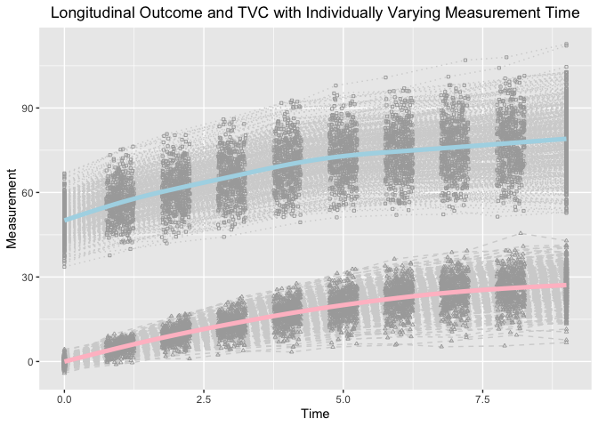
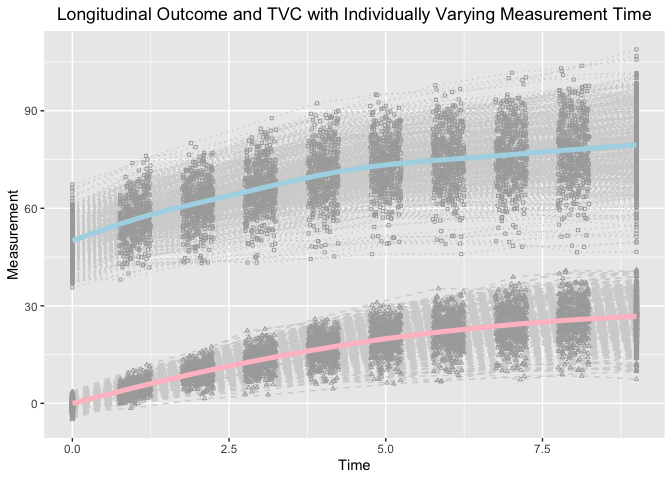

Estimating knots and Knot-knot Association of PBLSGMs in the framework
of individual measurement occasions
================
Jin Liu

## OS, R version and OpenMx Version

``` r
library(OpenMx)
```

    ## OpenMx may run faster if it is compiled to take advantage of multiple cores.

``` r
OpenMx::mxOption(model = NULL, key = "Default optimizer", "CSOLNP", reset = FALSE)
OpenMx::mxVersion()
```

    ## OpenMx version: 2.21.8 [GIT v2.21.8]
    ## R version: R version 4.2.2 (2022-10-31)
    ## Platform: aarch64-apple-darwin20 
    ## MacOS: 14.4.1
    ## Default optimizer: CSOLNP
    ## NPSOL-enabled?: No
    ## OpenMP-enabled?: No

## Require package would be used

``` r
library(tidyr)
library(ggplot2)
```

## First Model: Longitudinal Model with TVC (w/ Interval-specific Slopes)

### Read in dataset for analyses (wide-format data)

``` r
source("GMM_TVC1.R")
```

### Summarize data

``` r
summary(dat[[2]])
```

    ##        id              Y1              Y2              Y3       
    ##  Min.   :  1.0   Min.   :33.61   Min.   :37.66   Min.   :41.96  
    ##  1st Qu.:125.8   1st Qu.:46.07   1st Qu.:52.38   1st Qu.:56.53  
    ##  Median :250.5   Median :49.60   Median :56.42   Median :60.90  
    ##  Mean   :250.5   Mean   :49.84   Mean   :56.74   Mean   :61.22  
    ##  3rd Qu.:375.2   3rd Qu.:53.29   3rd Qu.:60.88   3rd Qu.:65.87  
    ##  Max.   :500.0   Max.   :66.81   Max.   :76.31   Max.   :80.76  
    ##        Y4              Y5              Y6              Y7        
    ##  Min.   :44.22   Min.   :49.41   Min.   :51.16   Min.   : 52.02  
    ##  1st Qu.:60.27   1st Qu.:64.40   1st Qu.:67.57   1st Qu.: 68.73  
    ##  Median :65.72   Median :69.77   Median :72.93   Median : 74.59  
    ##  Mean   :65.47   Mean   :70.02   Mean   :72.99   Mean   : 74.51  
    ##  3rd Qu.:70.78   3rd Qu.:75.59   3rd Qu.:78.64   3rd Qu.: 80.61  
    ##  Max.   :86.10   Max.   :92.70   Max.   :97.96   Max.   :100.82  
    ##        Y8               Y9              Y10               T1   
    ##  Min.   : 52.23   Min.   : 51.41   Min.   : 52.75   Min.   :0  
    ##  1st Qu.: 69.33   1st Qu.: 70.31   1st Qu.: 71.14   1st Qu.:0  
    ##  Median : 76.32   Median : 78.31   Median : 79.37   Median :0  
    ##  Mean   : 76.02   Mean   : 77.58   Mean   : 79.03   Mean   :0  
    ##  3rd Qu.: 82.30   3rd Qu.: 84.22   3rd Qu.: 85.81   3rd Qu.:0  
    ##  Max.   :106.98   Max.   :108.00   Max.   :112.72   Max.   :0  
    ##        T2               T3              T4              T5       
    ##  Min.   :0.7511   Min.   :1.751   Min.   :2.751   Min.   :3.752  
    ##  1st Qu.:0.8865   1st Qu.:1.882   1st Qu.:2.862   1st Qu.:3.876  
    ##  Median :1.0020   Median :2.006   Median :2.987   Median :4.004  
    ##  Mean   :1.0007   Mean   :2.001   Mean   :2.990   Mean   :3.998  
    ##  3rd Qu.:1.1166   3rd Qu.:2.121   3rd Qu.:3.113   3rd Qu.:4.113  
    ##  Max.   :1.2493   Max.   :2.249   Max.   :3.250   Max.   :4.249  
    ##        T6              T7              T8              T9             T10   
    ##  Min.   :4.750   Min.   :5.750   Min.   :6.750   Min.   :7.753   Min.   :9  
    ##  1st Qu.:4.873   1st Qu.:5.888   1st Qu.:6.865   1st Qu.:7.886   1st Qu.:9  
    ##  Median :4.994   Median :6.023   Median :6.978   Median :8.003   Median :9  
    ##  Mean   :4.998   Mean   :6.008   Mean   :6.989   Mean   :8.006   Mean   :9  
    ##  3rd Qu.:5.124   3rd Qu.:6.129   3rd Qu.:7.123   3rd Qu.:8.121   3rd Qu.:9  
    ##  Max.   :5.249   Max.   :6.250   Max.   :7.246   Max.   :8.249   Max.   :9  
    ##       TVC1               TVC2             TVC3              TVC4       
    ##  Min.   :-4.14125   Min.   :-1.062   Min.   : 0.9953   Min.   : 2.352  
    ##  1st Qu.:-0.97213   1st Qu.: 3.796   1st Qu.: 7.8427   1st Qu.:11.136  
    ##  Median :-0.18617   Median : 5.169   Median : 9.5101   Median :13.329  
    ##  Mean   :-0.06882   Mean   : 5.010   Mean   : 9.5034   Mean   :13.310  
    ##  3rd Qu.: 0.89972   3rd Qu.: 6.345   3rd Qu.:11.1188   3rd Qu.:15.570  
    ##  Max.   : 4.35834   Max.   : 9.883   Max.   :16.8553   Max.   :22.951  
    ##       TVC5            TVC6             TVC7             TVC8       
    ##  Min.   : 3.37   Min.   : 5.128   Min.   : 5.852   Min.   : 5.238  
    ##  1st Qu.:14.43   1st Qu.:17.114   1st Qu.:19.330   1st Qu.:21.088  
    ##  Median :17.09   Median :20.123   Median :22.922   Median :24.935  
    ##  Mean   :17.02   Mean   :20.011   Mean   :22.642   Mean   :24.616  
    ##  3rd Qu.:19.59   3rd Qu.:23.081   3rd Qu.:26.186   3rd Qu.:28.508  
    ##  Max.   :27.70   Max.   :32.803   Max.   :36.389   Max.   :39.312  
    ##       TVC9            TVC10             gx1                gx2          
    ##  Min.   : 5.553   Min.   : 6.723   Min.   :-2.82348   Min.   :-3.67043  
    ##  1st Qu.:22.344   1st Qu.:23.227   1st Qu.:-0.76706   1st Qu.:-0.70522  
    ##  Median :26.555   Median :27.279   Median :-0.05249   Median :-0.01970  
    ##  Mean   :26.101   Mean   :27.077   Mean   :-0.07362   Mean   :-0.01034  
    ##  3rd Qu.:30.160   3rd Qu.:31.301   3rd Qu.: 0.59795   3rd Qu.: 0.64309  
    ##  Max.   :45.510   Max.   :42.873   Max.   : 2.92366   Max.   : 2.96321  
    ##      class           TIC          
    ##  Min.   :1.00   Min.   :-2.37593  
    ##  1st Qu.:1.00   1st Qu.:-0.60048  
    ##  Median :1.00   Median : 0.01358  
    ##  Mean   :1.47   Mean   : 0.05125  
    ##  3rd Qu.:2.00   3rd Qu.: 0.70185  
    ##  Max.   :2.00   Max.   : 2.56055

### Visualize data

``` r
long_dat_T <- gather(dat[[2]][, c(1, 12:21), ], key = var.T, value = time, T1:T10)
long_dat_Y <- gather(dat[[2]][, c(1, 2:11), ], key = var.Y, value = measuresY, Y1:Y10)
long_dat_Y$outcome <- "Y"
long_dat_TVC <- gather(dat[[2]][, c(1, 22:31), ], key = var.TVC, value = measuresTVC, TVC1:TVC10)
long_dat_TVC$outcome <- "TVC"
long_dat <- data.frame(id = rep(long_dat_T$id, 2),
                       time = rep(long_dat_T$time, 2),
                       measures = c(long_dat_Y$measuresY, long_dat_TVC$measuresTVC),
                       outcome = c(long_dat_Y$outcome, long_dat_TVC$outcome))

ggplot(aes(x = time, y = measures), data = long_dat) +
  geom_line(aes(group = id), color = "lightgrey", linetype = "dotted", 
            data = long_dat[long_dat$outcome == "Y", ]) +
  geom_line(aes(group = id), color = "lightgrey", linetype = "dashed", 
            data = long_dat[long_dat$outcome == "TVC", ]) +
  geom_point(aes(group = id), color = "darkgrey", shape = 0,
             data = long_dat[long_dat$outcome == "Y", ], size = 0.8) +
  geom_point(aes(group = id), color = "darkgrey", shape = 2,
             data = long_dat[long_dat$outcome == "TVC", ], size = 0.8) +
  geom_smooth(aes(group = 1), size = 1.8, col = "lightblue", se = F, 
              data = long_dat[long_dat$outcome == "Y", ] ) + 
  geom_smooth(aes(group = 1), size = 1.8, col = "pink", se = F, 
              data = long_dat[long_dat$outcome == "TVC", ] ) + 
  labs(title = "Longitudinal Outcome and TVC with Individually Varying Measurement Time",
       x ="Time", y = "Measurement") + 
  theme(plot.title = element_text(hjust = 0.5))
```

    ## Warning: Using `size` aesthetic for lines was deprecated in ggplot2 3.4.0.
    ## ℹ Please use `linewidth` instead.
    ## This warning is displayed once every 8 hours.
    ## Call `lifecycle::last_lifecycle_warnings()` to see where this warning was
    ## generated.

    ## `geom_smooth()` using method = 'gam' and formula = 'y ~ s(x, bs = "cs")'
    ## `geom_smooth()` using method = 'gam' and formula = 'y ~ s(x, bs = "cs")'

<!-- -->

``` r
outTVC
```

    ##               Name    Estimate         SE        true
    ## 1       c1Y_mueta0 47.75660142 0.34025079 48.00000000
    ## 2       c1Y_mueta1  4.41833377 0.06553984  4.50000000
    ## 3       c1Y_mueta2  1.64185938 0.07161764  1.65000000
    ## 4          c1Y_mug  4.94113221 0.02991519  5.00000000
    ## 5  c1Y_psi00_unexp 18.09670099 1.85519058 18.49999897
    ## 6  c1Y_psi01_unexp  0.43148400 0.27043814  0.20000002
    ## 7  c1Y_psi02_unexp  0.34755233 0.29661098  0.20000002
    ## 8  c1Y_psi11_unexp  0.73932651 0.07900520  0.74000005
    ## 9  c1Y_psi12_unexp  0.07295569 0.06134497  0.04000005
    ## 10 c1Y_psi22_unexp  0.71826247 0.08446344  0.74000005
    ## 11      c1X_mueta0 -0.19852988 0.08801344  0.00000000
    ## 12      c1X_mueta1  5.05561670 0.10772307  5.00000000
    ## 13       c1X_psi00  0.85020853 0.12116346  1.00000000
    ## 14       c1X_psi01  0.16278279 0.07704013  0.30000000
    ## 15       c1X_psi11  1.05580445 0.10604756  1.00000000
    ## 16     c1rel_rate3  0.87188734 0.02668603  0.90000000
    ## 17     c1rel_rate4  0.76517817 0.02139574  0.80000000
    ## 18     c1rel_rate5  0.70966484 0.02026783  0.70000000
    ## 19     c1rel_rate6  0.57370455 0.01887459  0.60000000
    ## 20     c1rel_rate7  0.50231771 0.01802373  0.50000000
    ## 21     c1rel_rate8  0.39979782 0.01747436  0.40000000
    ## 22     c1rel_rate9  0.28732873 0.01599591  0.30000000
    ## 23    c1rel_rate10  0.17124234 0.01755795  0.20000000
    ## 24     c1abs_rate3  4.40792820 4.40792820  4.50000000
    ## 25     c1abs_rate4  3.86844752 3.86844752  4.00000000
    ## 26     c1abs_rate5  3.58779340 3.58779340  3.50000000
    ## 27     c1abs_rate6  2.90043032 2.90043032  3.00000000
    ## 28     c1abs_rate7  2.53952579 2.53952579  2.50000000
    ## 29     c1abs_rate8  2.02122456 2.02122456  2.00000000
    ## 30     c1abs_rate9  1.45262392 1.45262392  1.50000000
    ## 31    c1abs_rate10  0.86573565 0.86573565  1.00000000
    ## 32         c1muTIC  0.04627980 0.06240707  0.00000000
    ## 33        c1varTIC  0.90975803 0.08204299  1.00000000
    ## 34         c1covBL  0.23599967 0.07272998  0.30000000
    ## 35         c1kappa  0.27173251 0.01766680  0.30000000
    ## 36      c1betaTIC0  1.96749781 0.32579360  1.25150500
    ## 37      c1betaTIC1  0.23061937 0.06595715  0.25030100
    ## 38      c1betaTIC2  0.25630328 0.06820576  0.25030100
    ## 39      c1betaTVC0  1.90545996 0.43222255  1.87725800
    ## 40      c1betaTVC1  0.26999725 0.08666653  0.37545150
    ## 41      c1betaTVC2  0.44283766 0.09035589  0.37545150
    ## 42    c1Y_residual  0.97634084 0.03462706  1.00000000
    ## 43    c1X_residual  1.00821518 0.03236561  1.00000000
    ## 44     c1Cov_XYres  0.32892414 0.02530961  0.30000000
    ## 45      c2Y_mueta0 52.11772494 0.36016627 52.00000000
    ## 46      c2Y_mueta1  4.95512601 0.07917126  5.00000000
    ## 47      c2Y_mueta2  1.84090723 0.07446577  1.80000000
    ## 48         c2Y_mug  4.02259844 0.03030786  4.00000000
    ## 49 c2Y_psi00_unexp 22.97694448 2.27290435 21.74999949
    ## 50 c2Y_psi01_unexp  0.54935365 0.32565189  0.85000001
    ## 51 c2Y_psi02_unexp  0.74092023 0.33926285  0.85000001
    ## 52 c2Y_psi11_unexp  0.83546587 0.09586374  0.87000002
    ## 53 c2Y_psi12_unexp  0.16557997 0.06929015  0.17000002
    ## 54 c2Y_psi22_unexp  0.87224542 0.09420493  0.87000002
    ## 55      c2X_mueta0  0.04970503 0.08957015  0.00000000
    ## 56      c2X_mueta1  5.11158300 0.10495201  5.00000000
    ## 57       c2X_psi00  0.76570614 0.11965117  1.00000000
    ## 58       c2X_psi01  0.31472398 0.08020570  0.30000000
    ## 59       c2X_psi11  1.03625039 0.10902431  1.00000000
    ## 60     c2rel_rate3  0.89571504 0.02225766  0.90000000
    ## 61     c2rel_rate4  0.77329413 0.01918853  0.80000000
    ## 62     c2rel_rate5  0.71281575 0.01816782  0.70000000
    ## 63     c2rel_rate6  0.62660638 0.01647073  0.60000000
    ## 64     c2rel_rate7  0.50209752 0.01526213  0.50000000
    ## 65     c2rel_rate8  0.39824006 0.01479227  0.40000000
    ## 66     c2rel_rate9  0.28762714 0.01371716  0.30000000
    ## 67    c2rel_rate10  0.20865464 0.01606522  0.20000000
    ## 68     c2abs_rate3  4.57852177 4.57852177  4.50000000
    ## 69     c2abs_rate4  3.95275715 3.95275715  4.00000000
    ## 70     c2abs_rate5  3.64361688 3.64361688  3.50000000
    ## 71     c2abs_rate6  3.20295052 3.20295052  3.00000000
    ## 72     c2abs_rate7  2.56651313 2.56651313  2.50000000
    ## 73     c2abs_rate8  2.03563710 2.03563710  2.00000000
    ## 74     c2abs_rate9  1.47023001 1.47023001  1.50000000
    ## 75    c2abs_rate10  1.06655549 1.06655549  1.00000000
    ## 76         c2muTIC  0.05670596 0.06413926  0.00000000
    ## 77        c2varTIC  0.85749626 0.08165610  1.00000000
    ## 78         c2covBL  0.22700976 0.07104752  0.30000000
    ## 79         c2kappa  0.62273006 0.02005336  0.60000000
    ## 80      c2betaTIC0  1.29858112 0.38124106  0.88494767
    ## 81      c2betaTIC1  0.40046342 0.07781950  0.17698953
    ## 82      c2betaTIC2  0.32583837 0.07718919  0.17698953
    ## 83      c2betaTVC0  0.83277066 0.48863192  1.32742186
    ## 84      c2betaTVC1  0.23758334 0.10314597  0.26548430
    ## 85      c2betaTVC2  0.16137755 0.10067230  0.26548430
    ## 86    c2Y_residual  0.99183259 0.03689197  1.00000000
    ## 87    c2X_residual  0.98871318 0.03363622  1.00000000
    ## 88     c2Cov_XYres  0.28547286 0.02630906  0.30000000
    ## 89          beta20 -0.07313668 0.11523965  0.00000000
    ## 90          beta21  0.32101058 0.11435882  0.40546511
    ## 91          beta22  0.53603265 0.11500951  0.53062825

## Second Model: Longitudinal Model with TVC (w/ Interval-specific Change)

### Read in dataset for analyses (wide-format data)

``` r
source("GMM_TVC2.R")
```

### Summarize data

``` r
summary(dat[[2]])
```

    ##        id              Y1              Y2              Y3       
    ##  Min.   :  1.0   Min.   :35.68   Min.   :38.06   Min.   :43.10  
    ##  1st Qu.:125.8   1st Qu.:46.18   1st Qu.:53.03   1st Qu.:57.49  
    ##  Median :250.5   Median :49.75   Median :56.88   Median :61.62  
    ##  Mean   :250.5   Mean   :49.90   Mean   :57.01   Mean   :61.43  
    ##  3rd Qu.:375.2   3rd Qu.:53.39   3rd Qu.:60.87   3rd Qu.:65.67  
    ##  Max.   :500.0   Max.   :67.37   Max.   :76.13   Max.   :80.07  
    ##        Y4              Y5              Y6              Y7       
    ##  Min.   :43.28   Min.   :44.41   Min.   :45.92   Min.   :45.91  
    ##  1st Qu.:61.32   1st Qu.:65.73   1st Qu.:68.48   1st Qu.:69.29  
    ##  Median :65.94   Median :70.15   Median :73.30   Median :75.03  
    ##  Mean   :66.02   Mean   :70.46   Mean   :73.40   Mean   :74.98  
    ##  3rd Qu.:70.93   3rd Qu.:75.27   3rd Qu.:78.69   3rd Qu.:80.81  
    ##  Max.   :87.71   Max.   :92.29   Max.   :95.02   Max.   :97.85  
    ##        Y8               Y9              Y10               T1   
    ##  Min.   : 48.17   Min.   : 46.50   Min.   : 46.63   Min.   :0  
    ##  1st Qu.: 70.71   1st Qu.: 71.98   1st Qu.: 72.60   1st Qu.:0  
    ##  Median : 76.59   Median : 78.32   Median : 80.00   Median :0  
    ##  Mean   : 76.48   Mean   : 78.06   Mean   : 79.51   Mean   :0  
    ##  3rd Qu.: 82.85   3rd Qu.: 84.76   3rd Qu.: 86.77   3rd Qu.:0  
    ##  Max.   :101.71   Max.   :103.85   Max.   :108.88   Max.   :0  
    ##        T2               T3              T4              T5       
    ##  Min.   :0.7504   Min.   :1.750   Min.   :2.750   Min.   :3.751  
    ##  1st Qu.:0.8871   1st Qu.:1.878   1st Qu.:2.880   1st Qu.:3.883  
    ##  Median :1.0110   Median :2.003   Median :3.001   Median :4.012  
    ##  Mean   :1.0072   Mean   :2.006   Mean   :3.002   Mean   :4.007  
    ##  3rd Qu.:1.1372   3rd Qu.:2.124   3rd Qu.:3.131   3rd Qu.:4.133  
    ##  Max.   :1.2495   Max.   :2.250   Max.   :3.248   Max.   :4.249  
    ##        T6              T7              T8              T9             T10   
    ##  Min.   :4.752   Min.   :5.752   Min.   :6.750   Min.   :7.752   Min.   :9  
    ##  1st Qu.:4.865   1st Qu.:5.865   1st Qu.:6.869   1st Qu.:7.855   1st Qu.:9  
    ##  Median :4.988   Median :6.001   Median :6.993   Median :7.971   Median :9  
    ##  Mean   :4.993   Mean   :5.995   Mean   :6.997   Mean   :7.984   Mean   :9  
    ##  3rd Qu.:5.113   3rd Qu.:6.122   3rd Qu.:7.120   3rd Qu.:8.113   3rd Qu.:9  
    ##  Max.   :5.250   Max.   :6.250   Max.   :7.250   Max.   :8.247   Max.   :9  
    ##       TVC1               TVC2             TVC3             TVC4       
    ##  Min.   :-4.97372   Min.   :-1.481   Min.   : 1.480   Min.   : 2.636  
    ##  1st Qu.:-0.96431   1st Qu.: 3.518   1st Qu.: 7.654   1st Qu.:11.247  
    ##  Median :-0.08443   Median : 4.819   Median : 9.396   Median :13.474  
    ##  Mean   :-0.04533   Mean   : 4.870   Mean   : 9.446   Mean   :13.352  
    ##  3rd Qu.: 0.94181   3rd Qu.: 6.181   3rd Qu.:11.171   3rd Qu.:15.734  
    ##  Max.   : 3.60423   Max.   :11.851   Max.   :17.429   Max.   :22.850  
    ##       TVC5             TVC6             TVC7             TVC8       
    ##  Min.   : 4.477   Min.   : 5.983   Min.   : 6.655   Min.   : 7.266  
    ##  1st Qu.:14.225   1st Qu.:16.848   1st Qu.:18.844   1st Qu.:20.633  
    ##  Median :17.051   Median :19.909   Median :22.273   Median :24.395  
    ##  Mean   :16.852   Mean   :19.900   Mean   :22.209   Mean   :24.207  
    ##  3rd Qu.:19.726   3rd Qu.:23.306   3rd Qu.:25.784   3rd Qu.:28.027  
    ##  Max.   :25.910   Max.   :31.006   Max.   :35.320   Max.   :38.838  
    ##       TVC9           TVC10             gx1                 gx2          
    ##  Min.   : 8.40   Min.   : 7.454   Min.   :-2.774947   Min.   :-2.89186  
    ##  1st Qu.:22.21   1st Qu.:22.992   1st Qu.:-0.724763   1st Qu.:-0.68836  
    ##  Median :25.76   Median :27.007   Median :-0.005744   Median : 0.02578  
    ##  Mean   :25.72   Mean   :26.742   Mean   : 0.012454   Mean   : 0.06211  
    ##  3rd Qu.:29.80   3rd Qu.:30.848   3rd Qu.: 0.764446   3rd Qu.: 0.77335  
    ##  Max.   :40.86   Max.   :41.145   Max.   : 2.692050   Max.   : 3.17464  
    ##      class            TIC          
    ##  Min.   :1.000   Min.   :-2.99703  
    ##  1st Qu.:1.000   1st Qu.:-0.62530  
    ##  Median :2.000   Median : 0.08774  
    ##  Mean   :1.508   Mean   : 0.03074  
    ##  3rd Qu.:2.000   3rd Qu.: 0.69527  
    ##  Max.   :2.000   Max.   : 3.02541

### Visualize data

``` r
long_dat_T <- gather(dat[[2]][, c(1, 12:21), ], key = var.T, value = time, T1:T10)
long_dat_Y <- gather(dat[[2]][, c(1, 2:11), ], key = var.Y, value = measuresY, Y1:Y10)
long_dat_Y$outcome <- "Y"
long_dat_TVC <- gather(dat[[2]][, c(1, 22:31), ], key = var.TVC, value = measuresTVC, TVC1:TVC10)
long_dat_TVC$outcome <- "TVC"
long_dat <- data.frame(id = rep(long_dat_T$id, 2),
                       time = rep(long_dat_T$time, 2),
                       measures = c(long_dat_Y$measuresY, long_dat_TVC$measuresTVC),
                       outcome = c(long_dat_Y$outcome, long_dat_TVC$outcome))

ggplot(aes(x = time, y = measures), data = long_dat) +
  geom_line(aes(group = id), color = "lightgrey", linetype = "dotted", 
            data = long_dat[long_dat$outcome == "Y", ]) +
  geom_line(aes(group = id), color = "lightgrey", linetype = "dashed", 
            data = long_dat[long_dat$outcome == "TVC", ]) +
  geom_point(aes(group = id), color = "darkgrey", shape = 0,
             data = long_dat[long_dat$outcome == "Y", ], size = 0.8) +
  geom_point(aes(group = id), color = "darkgrey", shape = 2,
             data = long_dat[long_dat$outcome == "TVC", ], size = 0.8) +
  geom_smooth(aes(group = 1), size = 1.8, col = "lightblue", se = F, 
              data = long_dat[long_dat$outcome == "Y", ] ) + 
  geom_smooth(aes(group = 1), size = 1.8, col = "pink", se = F, 
              data = long_dat[long_dat$outcome == "TVC", ] ) + 
  labs(title = "Longitudinal Outcome and TVC with Individually Varying Measurement Time",
       x ="Time", y = "Measurement") + 
  theme(plot.title = element_text(hjust = 0.5))
```

    ## `geom_smooth()` using method = 'gam' and formula = 'y ~ s(x, bs = "cs")'
    ## `geom_smooth()` using method = 'gam' and formula = 'y ~ s(x, bs = "cs")'

<!-- -->

``` r
outTVC
```

    ##               Name     Estimate         SE        true
    ## 1       c1Y_mueta0 47.980212362 0.34920101 48.00000000
    ## 2       c1Y_mueta1  4.556729330 0.07510938  4.50000000
    ## 3       c1Y_mueta2  1.692562898 0.07304531  1.65000000
    ## 4          c1Y_mug  5.004356703 0.02962999  5.00000000
    ## 5  c1Y_psi00_unexp 15.396068334 1.86176069 18.49999897
    ## 6  c1Y_psi01_unexp  0.236231436 0.30172963  0.20000002
    ## 7  c1Y_psi02_unexp -0.121049473 0.29021353  0.20000002
    ## 8  c1Y_psi11_unexp  0.729290388 0.08507840  0.74000005
    ## 9  c1Y_psi12_unexp -0.012104607 0.06064792  0.04000005
    ## 10 c1Y_psi22_unexp  0.643276412 0.08478376  0.74000005
    ## 11      c1X_mueta0 -0.063316541 0.09901559  0.00000000
    ## 12      c1X_mueta1  4.986555391 0.11294757  5.00000000
    ## 13       c1X_psi00  1.122547546 0.15482547  1.00000000
    ## 14       c1X_psi01  0.128527504 0.08092242  0.30000000
    ## 15       c1X_psi11  1.041685440 0.11698613  1.00000000
    ## 16     c1rel_rate3  0.908549730 0.02898630  0.90000000
    ## 17     c1rel_rate4  0.813883480 0.02345696  0.80000000
    ## 18     c1rel_rate5  0.674550252 0.02122612  0.70000000
    ## 19     c1rel_rate6  0.649664184 0.02131126  0.60000000
    ## 20     c1rel_rate7  0.482753931 0.01896679  0.50000000
    ## 21     c1rel_rate8  0.387607094 0.01814851  0.40000000
    ## 22     c1rel_rate9  0.323329154 0.01799172  0.30000000
    ## 23    c1rel_rate10  0.196305858 0.01857521  0.20000000
    ## 24     c1abs_rate3  4.530533556 4.53053356  4.50000000
    ## 25     c1abs_rate4  4.058475056 4.05847506  4.00000000
    ## 26     c1abs_rate5  3.363682194 3.36368219  3.50000000
    ## 27     c1abs_rate6  3.239586440 3.23958644  3.00000000
    ## 28     c1abs_rate7  2.407279216 2.40727922  2.50000000
    ## 29     c1abs_rate8  1.932824244 1.93282424  2.00000000
    ## 30     c1abs_rate9  1.612298736 1.61229874  1.50000000
    ## 31    c1abs_rate10  0.978890035 0.97889003  1.00000000
    ## 32         c1muTIC  0.008516407 0.06810715  0.00000000
    ## 33        c1varTIC  1.005343206 0.09590129  1.00000000
    ## 34         c1covBL  0.388036195 0.08950104  0.30000000
    ## 35         c1kappa  0.288984641 0.01551863  0.30000000
    ## 36      c1betaTIC0  1.035718352 0.32337675  1.25150500
    ## 37      c1betaTIC1  0.313971765 0.06972271  0.25030100
    ## 38      c1betaTIC2  0.193308298 0.06804682  0.25030100
    ## 39      c1betaTVC0  2.441640822 0.38743644  1.87725800
    ## 40      c1betaTVC1  0.420957656 0.08304989  0.37545150
    ## 41      c1betaTVC2  0.430528913 0.07793621  0.37545150
    ## 42    c1Y_residual  0.937503222 0.03502723  1.00000000
    ## 43    c1X_residual  1.057321675 0.03606304  1.00000000
    ## 44     c1Cov_XYres  0.310267736 0.02629492  0.30000000
    ## 45      c2Y_mueta0 51.632025056 0.32624962 52.00000000
    ## 46      c2Y_mueta1  4.952543948 0.06817284  5.00000000
    ## 47      c2Y_mueta2  1.789134086 0.06711909  1.80000000
    ## 48         c2Y_mug  4.036857458 0.02748829  4.00000000
    ## 49 c2Y_psi00_unexp 19.778959350 1.89846971 21.74999949
    ## 50 c2Y_psi01_unexp  0.371150136 0.28923242  0.85000001
    ## 51 c2Y_psi02_unexp  0.999071117 0.29106832  0.85000001
    ## 52 c2Y_psi11_unexp  0.758259480 0.08414433  0.87000002
    ## 53 c2Y_psi12_unexp  0.138639694 0.06127912  0.17000002
    ## 54 c2Y_psi22_unexp  0.847370838 0.08734814  0.87000002
    ## 55      c2X_mueta0 -0.069321541 0.08679694  0.00000000
    ## 56      c2X_mueta1  4.959598778 0.10049181  5.00000000
    ## 57       c2X_psi00  0.866966288 0.12242400  1.00000000
    ## 58       c2X_psi01  0.281665666 0.07902959  0.30000000
    ## 59       c2X_psi11  1.131651331 0.11479738  1.00000000
    ## 60     c2rel_rate3  0.886863567 0.02179125  0.90000000
    ## 61     c2rel_rate4  0.797816678 0.01857074  0.80000000
    ## 62     c2rel_rate5  0.706291035 0.01825543  0.70000000
    ## 63     c2rel_rate6  0.589140199 0.01620608  0.60000000
    ## 64     c2rel_rate7  0.482236140 0.01499721  0.50000000
    ## 65     c2rel_rate8  0.379240890 0.01400753  0.40000000
    ## 66     c2rel_rate9  0.321069634 0.01393219  0.30000000
    ## 67    c2rel_rate10  0.188754707 0.01566158  0.20000000
    ## 68     c2abs_rate3  4.398487463 4.39848746  4.50000000
    ## 69     c2abs_rate4  3.956850621 3.95685062  4.00000000
    ## 70     c2abs_rate5  3.502920153 3.50292015  3.50000000
    ## 71     c2abs_rate6  2.921899011 2.92189901  3.00000000
    ## 72     c2abs_rate7  2.391697771 2.39169777  2.50000000
    ## 73     c2abs_rate8  1.880882654 1.88088265  2.00000000
    ## 74     c2abs_rate9  1.592376567 1.59237657  1.50000000
    ## 75    c2abs_rate10  0.936147613 0.93614761  1.00000000
    ## 76         c2muTIC  0.050946623 0.06308724  0.00000000
    ## 77        c2varTIC  0.952912395 0.08662833  1.00000000
    ## 78         c2covBL  0.251747356 0.07397195  0.30000000
    ## 79         c2kappa  0.609602903 0.01648591  0.60000000
    ## 80      c2betaTIC0  0.920483093 0.31552323  0.88494767
    ## 81      c2betaTIC1  0.034293894 0.06610662  0.17698953
    ## 82      c2betaTIC2  0.220483241 0.06784652  0.17698953
    ## 83      c2betaTVC0  1.875532103 0.40995561  1.32742186
    ## 84      c2betaTVC1  0.364752997 0.08793372  0.26548430
    ## 85      c2betaTVC2  0.120234778 0.08598022  0.26548430
    ## 86    c2Y_residual  0.998127034 0.03495787  1.00000000
    ## 87    c2X_residual  1.010870626 0.03286507  1.00000000
    ## 88     c2Cov_XYres  0.291636452 0.02529211  0.30000000
    ## 89          beta20  0.082641750 0.11577061  0.00000000
    ## 90          beta21  0.682001827 0.11891500  0.40546511
    ## 91          beta22  0.465833001 0.11161908  0.53062825

## Third Model: Longitudinal Model with TVC (w/ Change from Baseline)

### Read in dataset for analyses (wide-format data)

``` r
source("GMM_TVC3.R")
```

### Summarize data

``` r
summary(dat[[2]])
```

    ##        id              Y1              Y2              Y3       
    ##  Min.   :  1.0   Min.   :35.68   Min.   :38.06   Min.   :43.10  
    ##  1st Qu.:125.8   1st Qu.:46.18   1st Qu.:53.03   1st Qu.:57.49  
    ##  Median :250.5   Median :49.75   Median :56.88   Median :61.62  
    ##  Mean   :250.5   Mean   :49.90   Mean   :57.01   Mean   :61.43  
    ##  3rd Qu.:375.2   3rd Qu.:53.39   3rd Qu.:60.87   3rd Qu.:65.67  
    ##  Max.   :500.0   Max.   :67.37   Max.   :76.13   Max.   :80.07  
    ##        Y4              Y5              Y6              Y7       
    ##  Min.   :43.28   Min.   :44.41   Min.   :45.92   Min.   :45.91  
    ##  1st Qu.:61.32   1st Qu.:65.73   1st Qu.:68.48   1st Qu.:69.29  
    ##  Median :65.94   Median :70.15   Median :73.30   Median :75.03  
    ##  Mean   :66.02   Mean   :70.46   Mean   :73.40   Mean   :74.98  
    ##  3rd Qu.:70.93   3rd Qu.:75.27   3rd Qu.:78.69   3rd Qu.:80.81  
    ##  Max.   :87.71   Max.   :92.29   Max.   :95.02   Max.   :97.85  
    ##        Y8               Y9              Y10               T1   
    ##  Min.   : 48.17   Min.   : 46.50   Min.   : 46.63   Min.   :0  
    ##  1st Qu.: 70.71   1st Qu.: 71.98   1st Qu.: 72.60   1st Qu.:0  
    ##  Median : 76.59   Median : 78.32   Median : 80.00   Median :0  
    ##  Mean   : 76.48   Mean   : 78.06   Mean   : 79.51   Mean   :0  
    ##  3rd Qu.: 82.85   3rd Qu.: 84.76   3rd Qu.: 86.77   3rd Qu.:0  
    ##  Max.   :101.71   Max.   :103.85   Max.   :108.88   Max.   :0  
    ##        T2               T3              T4              T5       
    ##  Min.   :0.7504   Min.   :1.750   Min.   :2.750   Min.   :3.751  
    ##  1st Qu.:0.8871   1st Qu.:1.878   1st Qu.:2.880   1st Qu.:3.883  
    ##  Median :1.0110   Median :2.003   Median :3.001   Median :4.012  
    ##  Mean   :1.0072   Mean   :2.006   Mean   :3.002   Mean   :4.007  
    ##  3rd Qu.:1.1372   3rd Qu.:2.124   3rd Qu.:3.131   3rd Qu.:4.133  
    ##  Max.   :1.2495   Max.   :2.250   Max.   :3.248   Max.   :4.249  
    ##        T6              T7              T8              T9             T10   
    ##  Min.   :4.752   Min.   :5.752   Min.   :6.750   Min.   :7.752   Min.   :9  
    ##  1st Qu.:4.865   1st Qu.:5.865   1st Qu.:6.869   1st Qu.:7.855   1st Qu.:9  
    ##  Median :4.988   Median :6.001   Median :6.993   Median :7.971   Median :9  
    ##  Mean   :4.993   Mean   :5.995   Mean   :6.997   Mean   :7.984   Mean   :9  
    ##  3rd Qu.:5.113   3rd Qu.:6.122   3rd Qu.:7.120   3rd Qu.:8.113   3rd Qu.:9  
    ##  Max.   :5.250   Max.   :6.250   Max.   :7.250   Max.   :8.247   Max.   :9  
    ##       TVC1               TVC2             TVC3             TVC4       
    ##  Min.   :-4.97372   Min.   :-1.481   Min.   : 1.480   Min.   : 2.636  
    ##  1st Qu.:-0.96431   1st Qu.: 3.518   1st Qu.: 7.654   1st Qu.:11.247  
    ##  Median :-0.08443   Median : 4.819   Median : 9.396   Median :13.474  
    ##  Mean   :-0.04533   Mean   : 4.870   Mean   : 9.446   Mean   :13.352  
    ##  3rd Qu.: 0.94181   3rd Qu.: 6.181   3rd Qu.:11.171   3rd Qu.:15.734  
    ##  Max.   : 3.60423   Max.   :11.851   Max.   :17.429   Max.   :22.850  
    ##       TVC5             TVC6             TVC7             TVC8       
    ##  Min.   : 4.477   Min.   : 5.983   Min.   : 6.655   Min.   : 7.266  
    ##  1st Qu.:14.225   1st Qu.:16.848   1st Qu.:18.844   1st Qu.:20.633  
    ##  Median :17.051   Median :19.909   Median :22.273   Median :24.395  
    ##  Mean   :16.852   Mean   :19.900   Mean   :22.209   Mean   :24.207  
    ##  3rd Qu.:19.726   3rd Qu.:23.306   3rd Qu.:25.784   3rd Qu.:28.027  
    ##  Max.   :25.910   Max.   :31.006   Max.   :35.320   Max.   :38.838  
    ##       TVC9           TVC10             gx1                 gx2          
    ##  Min.   : 8.40   Min.   : 7.454   Min.   :-2.774947   Min.   :-2.89186  
    ##  1st Qu.:22.21   1st Qu.:22.992   1st Qu.:-0.724763   1st Qu.:-0.68836  
    ##  Median :25.76   Median :27.007   Median :-0.005744   Median : 0.02578  
    ##  Mean   :25.72   Mean   :26.742   Mean   : 0.012454   Mean   : 0.06211  
    ##  3rd Qu.:29.80   3rd Qu.:30.848   3rd Qu.: 0.764446   3rd Qu.: 0.77335  
    ##  Max.   :40.86   Max.   :41.145   Max.   : 2.692050   Max.   : 3.17464  
    ##      class            TIC          
    ##  Min.   :1.000   Min.   :-2.99703  
    ##  1st Qu.:1.000   1st Qu.:-0.62530  
    ##  Median :2.000   Median : 0.08774  
    ##  Mean   :1.508   Mean   : 0.03074  
    ##  3rd Qu.:2.000   3rd Qu.: 0.69527  
    ##  Max.   :2.000   Max.   : 3.02541

### Visualize data

``` r
long_dat_T <- gather(dat[[2]][, c(1, 12:21), ], key = var.T, value = time, T1:T10)
long_dat_Y <- gather(dat[[2]][, c(1, 2:11), ], key = var.Y, value = measuresY, Y1:Y10)
long_dat_Y$outcome <- "Y"
long_dat_TVC <- gather(dat[[2]][, c(1, 22:31), ], key = var.TVC, value = measuresTVC, TVC1:TVC10)
long_dat_TVC$outcome <- "TVC"
long_dat <- data.frame(id = rep(long_dat_T$id, 2),
                       time = rep(long_dat_T$time, 2),
                       measures = c(long_dat_Y$measuresY, long_dat_TVC$measuresTVC),
                       outcome = c(long_dat_Y$outcome, long_dat_TVC$outcome))

ggplot(aes(x = time, y = measures), data = long_dat) +
  geom_line(aes(group = id), color = "lightgrey", linetype = "dotted", 
            data = long_dat[long_dat$outcome == "Y", ]) +
  geom_line(aes(group = id), color = "lightgrey", linetype = "dashed", 
            data = long_dat[long_dat$outcome == "TVC", ]) +
  geom_point(aes(group = id), color = "darkgrey", shape = 0,
             data = long_dat[long_dat$outcome == "Y", ], size = 0.8) +
  geom_point(aes(group = id), color = "darkgrey", shape = 2,
             data = long_dat[long_dat$outcome == "TVC", ], size = 0.8) +
  geom_smooth(aes(group = 1), size = 1.8, col = "lightblue", se = F, 
              data = long_dat[long_dat$outcome == "Y", ] ) + 
  geom_smooth(aes(group = 1), size = 1.8, col = "pink", se = F, 
              data = long_dat[long_dat$outcome == "TVC", ] ) + 
  labs(title = "Longitudinal Outcome and TVC with Individually Varying Measurement Time",
       x ="Time", y = "Measurement") + 
  theme(plot.title = element_text(hjust = 0.5))
```

    ## `geom_smooth()` using method = 'gam' and formula = 'y ~ s(x, bs = "cs")'
    ## `geom_smooth()` using method = 'gam' and formula = 'y ~ s(x, bs = "cs")'

<!-- -->

``` r
outTVC
```

    ##               Name    Estimate         SE        true
    ## 1       c1Y_mueta0 48.00086930 0.37778753 48.00000000
    ## 2       c1Y_mueta1  2.93013210 0.24434040  4.50000000
    ## 3       c1Y_mueta2  0.83849146 0.12439243  1.65000000
    ## 4          c1Y_mug  4.94208903 0.04083121  5.00000000
    ## 5  c1Y_psi00_unexp 14.55209740 1.92011886 18.49999897
    ## 6  c1Y_psi01_unexp  0.22765210 0.31270662  0.20000002
    ## 7  c1Y_psi02_unexp  0.06477791 0.30560130  0.20000002
    ## 8  c1Y_psi11_unexp  0.85594307 0.10937858  0.74000005
    ## 9  c1Y_psi12_unexp  0.02253346 0.07184375  0.04000005
    ## 10 c1Y_psi22_unexp  0.68195670 0.09610732  0.74000005
    ## 11      c1X_mueta0 -0.20118486 0.11588318  0.00000000
    ## 12      c1X_mueta1  5.18494075 0.15025123  5.00000000
    ## 13       c1X_psi00  1.09847478 0.16673306  1.00000000
    ## 14       c1X_psi01 -0.01731083 0.10472902  0.30000000
    ## 15       c1X_psi11  1.28172190 0.15270362  1.00000000
    ## 16     c1rel_rate3  0.83815678 0.03568135  0.90000000
    ## 17     c1rel_rate4  0.76007752 0.02991711  0.80000000
    ## 18     c1rel_rate5  0.64379613 0.02436267  0.70000000
    ## 19     c1rel_rate6  0.62677495 0.02349878  0.60000000
    ## 20     c1rel_rate7  0.45744754 0.02229089  0.50000000
    ## 21     c1rel_rate8  0.37356114 0.02046298  0.40000000
    ## 22     c1rel_rate9  0.28950032 0.01994772  0.30000000
    ## 23    c1rel_rate10  0.20559634 0.01937678  0.20000000
    ## 24     c1abs_rate3  4.34579322 4.34579322  4.50000000
    ## 25     c1abs_rate4  3.94095693 3.94095693  4.00000000
    ## 26     c1abs_rate5  3.33804477 3.33804477  3.50000000
    ## 27     c1abs_rate6  3.24979100 3.24979100  3.00000000
    ## 28     c1abs_rate7  2.37183837 2.37183837  2.50000000
    ## 29     c1abs_rate8  1.93689235 1.93689235  2.00000000
    ## 30     c1abs_rate9  1.50104200 1.50104200  1.50000000
    ## 31    c1abs_rate10  1.06600483 1.06600483  1.00000000
    ## 32         c1muTIC -0.02226018 0.07399900  0.00000000
    ## 33        c1varTIC  1.02267310 0.10342575  1.00000000
    ## 34         c1covBL  0.36859822 0.09487922  0.30000000
    ## 35         c1kappa  0.41593941 0.05561053  0.30000000
    ## 36      c1betaTIC0  0.92518536 0.33682763  1.25150500
    ## 37      c1betaTIC1  0.36503554 0.07683316  0.25030100
    ## 38      c1betaTIC2  0.20742261 0.07419459  0.25030100
    ## 39      c1betaTVC0  2.48332014 0.41650968  1.87725800
    ## 40      c1betaTVC1  0.43209348 0.09785591  0.37545150
    ## 41      c1betaTVC2  0.43353538 0.08687850  0.37545150
    ## 42    c1Y_residual  1.02230507 0.04564951  1.00000000
    ## 43    c1X_residual  1.05821497 0.03856370  1.00000000
    ## 44     c1Cov_XYres  0.27141619 0.03172913  0.30000000
    ## 45      c2Y_mueta0 52.55619107 0.32981134 52.00000000
    ## 46      c2Y_mueta1  4.64622156 0.52244545  5.00000000
    ## 47      c2Y_mueta2  1.13711114 0.22885564  1.80000000
    ## 48         c2Y_mug  3.58352908 0.03309036  4.00000000
    ## 49 c2Y_psi00_unexp 18.77860431 1.81840529 21.74999949
    ## 50 c2Y_psi01_unexp  0.61601326 0.30910129  0.85000001
    ## 51 c2Y_psi02_unexp  0.92527068 0.28077659  0.85000001
    ## 52 c2Y_psi11_unexp  0.83563609 0.10618095  0.87000002
    ## 53 c2Y_psi12_unexp  0.20017204 0.07384143  0.17000002
    ## 54 c2Y_psi22_unexp  0.81178292 0.08643030  0.87000002
    ## 55      c2X_mueta0  0.06153789 0.13416923  0.00000000
    ## 56      c2X_mueta1  4.71060804 0.24777645  5.00000000
    ## 57       c2X_psi00  0.91999023 0.12796337  1.00000000
    ## 58       c2X_psi01  0.31142920 0.07265073  0.30000000
    ## 59       c2X_psi11  0.94089526 0.12585126  1.00000000
    ## 60     c2rel_rate3  0.99478507 0.07651190  0.90000000
    ## 61     c2rel_rate4  0.84091766 0.05897464  0.80000000
    ## 62     c2rel_rate5  0.75545448 0.03818487  0.70000000
    ## 63     c2rel_rate6  0.63265230 0.03242321  0.60000000
    ## 64     c2rel_rate7  0.49473260 0.03241593  0.50000000
    ## 65     c2rel_rate8  0.40850918 0.02907254  0.40000000
    ## 66     c2rel_rate9  0.34569980 0.02213288  0.30000000
    ## 67    c2rel_rate10  0.19668680 0.02073998  0.20000000
    ## 68     c2abs_rate3  4.68604257 4.68604257  4.50000000
    ## 69     c2abs_rate4  3.96123348 3.96123348  4.00000000
    ## 70     c2abs_rate5  3.55864993 3.55864993  3.50000000
    ## 71     c2abs_rate6  2.98017700 2.98017700  3.00000000
    ## 72     c2abs_rate7  2.33049136 2.33049136  2.50000000
    ## 73     c2abs_rate8  1.92432662 1.92432662  2.00000000
    ## 74     c2abs_rate9  1.62845624 1.62845624  1.50000000
    ## 75    c2abs_rate10  0.92651442 0.92651442  1.00000000
    ## 76         c2muTIC  0.07158106 0.06147689  0.00000000
    ## 77        c2varTIC  0.94032698 0.08281255  1.00000000
    ## 78         c2covBL  0.27102653 0.07309351  0.30000000
    ## 79         c2kappa  0.21990535 0.11318913  0.60000000
    ## 80      c2betaTIC0  0.92448076 0.31086660  0.88494767
    ## 81      c2betaTIC1  0.02758018 0.07204351  0.17698953
    ## 82      c2betaTIC2  0.24507029 0.06775551  0.17698953
    ## 83      c2betaTVC0  1.91545797 0.38454761  1.32742186
    ## 84      c2betaTVC1  0.21563069 0.10761950  0.26548430
    ## 85      c2betaTVC2  0.02700318 0.08588297  0.26548430
    ## 86    c2Y_residual  1.68742515 0.06179221  1.00000000
    ## 87    c2X_residual  1.01190899 0.03194139  1.00000000
    ## 88     c2Cov_XYres  0.33238922 0.05337758  0.30000000
    ## 89          beta20  0.28446801 0.13881178  0.00000000
    ## 90          beta21  0.71365772 0.12858299  0.40546511
    ## 91          beta22  0.46049244 0.11987300  0.53062825
