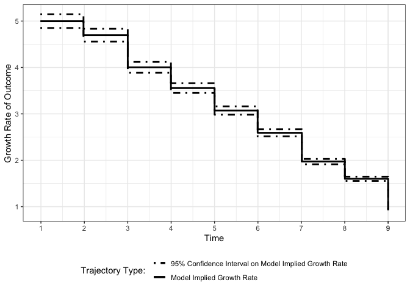

Estimating Rate of Change for Nonlinear Trajectories in the Framework of
Individual Measurement Occasions: A New Perspective on Growth Curves
================
Jin Liu

## OS, R version and OpenMx Version

``` r
library(nlpsem)
```

    ## Loading required package: OpenMx

    ## OpenMx may run faster if it is compiled to take advantage of multiple cores.

``` r
OpenMx::mxOption(model = NULL, key = "Default optimizer", "CSOLNP", reset = FALSE)
OpenMx::mxVersion()
```

    ## OpenMx version: 2.21.8 [GIT v2.21.8]
    ## R version: R version 4.2.2 (2022-10-31)
    ## Platform: aarch64-apple-darwin20 
    ## MacOS: 14.4.1
    ## Default optimizer: CSOLNP
    ## NPSOL-enabled?: No
    ## OpenMP-enabled?: No

## First Model: Latent Change Score Model with Nonparametric Functional Form

### Specify parameters need to be print out

``` r
paraLCSM_NonP <- c("mueta0", "mueta1", paste0("psi", c("00", "01", "11")), paste0("rel_rate", 1:9), "residuals", paste0("abs_rate", 1:9), paste0("abs_rate_se", 1:9),
                   paste0("change_in_interval", 1:9), paste0("change_in_interval_se", 1:9), paste0("change_from_baseline", 1:9), paste0("change_in_interval_se", 1:9))
```

### Read in dataset for analyses (wide-format data)

``` r
load("NonP_dat.RData")
```

### Fit the model

``` r
NonP_out <- getLCSM(dat = NonP_dat, t_var = "T", y_var = "Y", curveFun = "NonP", intrinsic = FALSE, records = 1:10, res_scale = 0.1, paramOut = TRUE, 
                    names = "paraLCSM_NonP")
```

### Visulize longitudinal outcomes

``` r
xstarts <- mean(NonP_dat$T1)
Figure1 <- getFigure(
  model = NonP_out@mxOutput, y_var = "Y", curveFun = "NonP", sub_Model = "LCSM", t_var = "T", records = 1:10, m_var = NULL, x_var = NULL,
  x_type = NULL, xstarts = xstarts, xlab = "Time", outcome = "Outcome"
)
```

    ## Treating first argument as an object that stores a character
    ## Treating first argument as an object that stores a character
    ## Treating first argument as an object that stores a character

``` r
show(Figure1)
```

    ## figOutput Object
    ## --------------------
    ## Trajectories: 1 
    ## Figure 1:

    ## `geom_smooth()` using method = 'gam' and formula = 'y ~ s(x, bs = "cs")'

<!-- -->

    ## Figure 2:

<!-- -->

## Second Model: Latent Change Score Model with Quadratic Functional Form

### Specify parameters need to be print out

``` r
paraLCSM_QUAD <- c("mueta0", "mueta1", "mueta2", paste0("psi", c("00", "01", "02", "11", "12", "22")), "residuals", paste0("abs_rate", 1:9), paste0("abs_rate_se", 1:9),
                   paste0("change_in_interval", 1:9), paste0("change_in_interval_se", 1:9), paste0("change_from_baseline", 1:9), paste0("change_in_interval_se", 1:9))
```

### Read in dataset for analyses (wide-format data)

``` r
load("QUAD_dat.RData")
```

### Fit the model

``` r
Quad_out <- getLCSM(dat = QUAD_dat, t_var = "T", y_var = "Y", curveFun = "QUAD", intrinsic = FALSE, records = 1:10, res_scale = 0.1, paramOut = TRUE, 
                    names = "paraLCSM_QUAD")
```

### Visulize longitudinal outcomes

``` r
xstarts <- mean(QUAD_dat$T1)
Figure2 <- getFigure(
  model = Quad_out@mxOutput, y_var = "Y", curveFun = "QUAD", sub_Model = "LCSM", t_var = "T", records = 1:10, m_var = NULL, x_var = NULL,
  x_type = NULL, xstarts = xstarts, xlab = "Time", outcome = "Outcome"
)
```

    ## Treating first argument as an object that stores a character

``` r
show(Figure2)
```

    ## figOutput Object
    ## --------------------
    ## Trajectories: 1 
    ## Figure 1:

    ## `geom_smooth()` using method = 'gam' and formula = 'y ~ s(x, bs = "cs")'

<!-- -->

    ## Figure 2:

<!-- -->

## Third Model: Latent Change Score Model with Exponential Functional Form

### Specify parameters need to be print out

``` r
paraLCSM_EXP <- c("mueta0", "mueta1", "ratio", paste0("psi", c("00", "01", "11")), "residuals", paste0("abs_rate", 1:9), paste0("abs_rate_se", 1:9),
                   paste0("change_in_interval", 1:9), paste0("change_in_interval_se", 1:9), paste0("change_from_baseline", 1:9), paste0("change_in_interval_se", 1:9))
```

### Read in dataset for analyses (wide-format data)

``` r
load("EXP_dat.RData")
```

### Fit the model

``` r
EXP_out <- getLCSM(dat = EXP_dat, t_var = "T", y_var = "Y", curveFun = "EXP", intrinsic = FALSE, records = 1:10, res_scale = 0.1, paramOut = TRUE, 
                   names = "paraLCSM_EXP")
```

### Visulize longitudinal outcomes

``` r
xstarts <- mean(EXP_dat$T1)
Figure3 <- getFigure(
  model = EXP_out@mxOutput, y_var = "Y", curveFun = "EXP", sub_Model = "LCSM", t_var = "T", records = 1:10, m_var = NULL, x_var = NULL,
  x_type = NULL, xstarts = xstarts, xlab = "Time", outcome = "Outcome"
)
```

    ## Treating first argument as an object that stores a character

``` r
show(Figure3)
```

    ## figOutput Object
    ## --------------------
    ## Trajectories: 1 
    ## Figure 1:

    ## `geom_smooth()` using method = 'gam' and formula = 'y ~ s(x, bs = "cs")'

<!-- -->

    ## Figure 2:

<!-- -->

## Fourth Model: Latent Change Score Model with Jenss-Bayley Functional Form

### Specify parameters need to be print out

``` r
paraLCSM_JB <- c("mueta0", "mueta1", "mueta2", "ratio", paste0("psi", c("00", "01", "02", "11", "12", "22")), "residuals", paste0("abs_rate", 1:9), 
                 paste0("abs_rate_se", 1:9), paste0("change_in_interval", 1:9), paste0("change_in_interval_se", 1:9), paste0("change_from_baseline", 1:9),
                 paste0("change_in_interval_se", 1:9))
```

### Read in dataset for analyses (wide-format data)

``` r
load("JB_dat.RData")
```

### Fit the model

``` r
JB_out <- getLCSM(dat = JB_dat, t_var = "T", y_var = "Y", curveFun = "JB", intrinsic = FALSE, records = 1:10, res_scale = 0.1, paramOut = TRUE, 
                  names = "paraLCSM_JB")
```

### Visulize longitudinal outcomes

``` r
xstarts <- mean(JB_dat$T1)
Figure4 <- getFigure(
  model = JB_out@mxOutput, y_var = "Y", curveFun = "JB", sub_Model = "LCSM", t_var = "T", records = 1:10, m_var = NULL, x_var = NULL,
  x_type = NULL, xstarts = xstarts, xlab = "Time", outcome = "Outcome"
)
```

    ## Treating first argument as an object that stores a character

``` r
show(Figure4)
```

    ## figOutput Object
    ## --------------------
    ## Trajectories: 1 
    ## Figure 1:

    ## `geom_smooth()` using method = 'gam' and formula = 'y ~ s(x, bs = "cs")'

<!-- -->

    ## Figure 2:

<!-- -->
